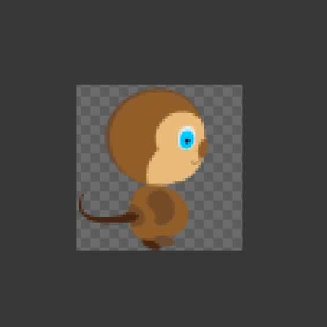
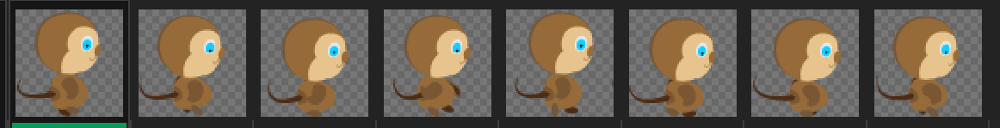
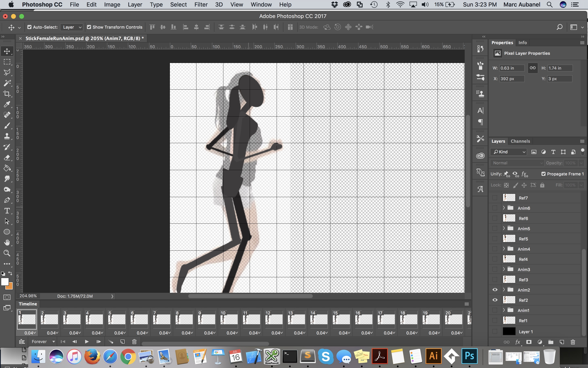

### Animation Tips

[previous](../run-cycle/README.md#user-content-animating-a-run-cycle) • [home](../README.md#user-content-gms2-background-tiles--sprites---table-of-contents)

Lets look at some suggestions for how we can approach animating characters that are more complex than simple doodles.

 

---

##### `Step 1.`\|`BTS`|:small_blue_diamond:

Now lets look at character animations. Animations for games are very different than ones for movies or cartoons. Each animation is atomic (each animation represents an individual action), mostly loopable and connect to each other in a logical manner. We also want animations to be short and crisp so that the player has maximum control over the player actions.  We typically exaggerate motion and move it quickly so the player can move fast on screen.

##### `Step 2.`\|`BTS`|:small_blue_diamond: :small_blue_diamond: 

What is the above animation composed of? This breaks a run cycle into 8 frames:

##### `Step 3.`\|`BTS`|:small_blue_diamond: :small_blue_diamond: :small_blue_diamond:

There are many tricks and techniques for animating characters. One of them is to start very simple and build more detail slowly:

##### `Step 4.`\|`BTS`|:small_blue_diamond: :small_blue_diamond: :small_blue_diamond: :small_blue_diamond:

You can also build it piece by piece:

##### `Step 5.`\|`BTS`| :small_orange_diamond:

For most animations some vertical translation helps a lot - make it bouncy.  Take a look at this amazing animation from <a href="http://probertson.tumblr.com/post/82062175084/mercenary-kings-animations" target="_blank">Mercenary Kings</a>. Keep it simple and represent the animation in as few frames as possible. Just as we want to get rid of the “grid” in the tiles; we want to lose a sense of where the animation is looping. Can you see the stitch? Can you guess how many animation frames there are? Can you see that different animations start and stop and there is a good demonstration of overlap going on here.

Look at the shading above in the feet of the robot. The back legs are dark which clearly delinates the front and back legs. In the old 8 bit games there were not enough colors in the pallette (or enough pixels in the character) to give detail and shadows. 

##### `Step 6.`\|`BTS`| :small_orange_diamond: :small_blue_diamond:

You can continue to trace on reference then build up the form gradually.

##### `Step 7.`\|`BTS`| :small_orange_diamond: :small_blue_diamond: :small_blue_diamond:

Now have fun and create some terrific animations for you next game!

___

| [previous](../run-cycle/README.md#user-content-animating-a-run-cycle)| [home](../README.md#user-content-gms2-background-tiles--sprites---table-of-contents) | 
|---|---|
