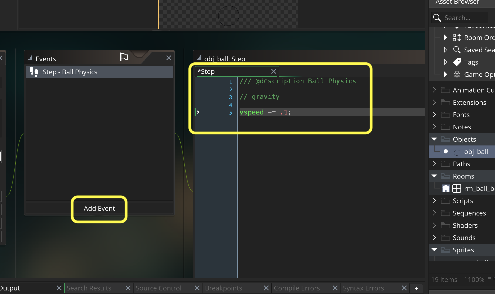
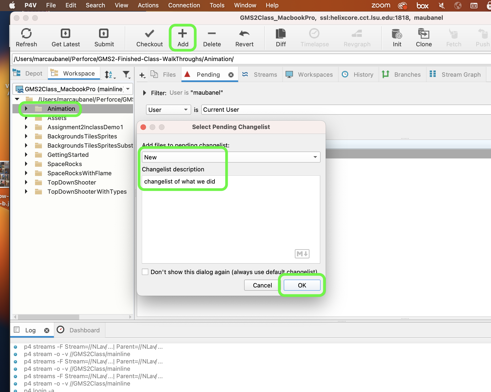

### Get Ball to Bounce

[previous](../setting-up/README.md#user-content-setting-up) • [home](../README.md#user-content-gms2-animation---table-of-contents) • [next](../horizontal-movement/README.md#user-content-horizontal-movement)

In the video you watched the physics were created by the animator.  They move the ball accross the screen.  The wider the distance per frame the faster the ball seems to move.  In games, objects move based on game physics.  So we do not animated translation just the different poses of the ball.  

 

---

##### `Step 1.`\|`ANIM`|:small_blue_diamond:

Open up **P4v**.  Select the top folder of the **GameMaker** project. Press the <kbd>Checkout</kbd> button.  Checkout out all files in P4V so that they are all writable (otherwise they will be read only and none of the changes will be saved). Select a **New** changelist and add a message describing the unit of work you will be performing. Press the <kbd>OK</kbd> button.

Open up the project you are working on in **GameMaker**. 

##### `Step 2.`\|`ANIM`|:small_blue_diamond: :small_blue_diamond: 

You can work on a large canvas and scale down, or work in actual size.  When drawing with a tablet I like to work on a larger image then scale down. Pick any 2-D pixel art package like **Photoshop** or **ProCreate**.  Select a separate white layer for the background and a layer for the ball.  Pick a pencil tool to make it look more old school.  I selected a 1024 x 1024 square that I will scale down later.  I drew a circle in the center with room for the bounce (wider) and stretch (diagonal) so all the key frames will fit in this shape.  It should look something like the below.

##### `Step 3.`\|`ANIM`|:small_blue_diamond: :small_blue_diamond: :small_blue_diamond:

Deselect the white background so it is on an Alpha.  We just want to see the ball outline. Select **Image | Trim** and trim all four corners to **Transparent Pixels**.  Press the <kbd>OK</kbd> button.

Select **Image | Image Size**. Scale the longest axis to   `128`.  Press the **Image | Image Canvas** and set the other axis to `128` and make sure the ball stays on the bottom of the frame.

Press **File | Quick Export as PNG** and call it `spr_ball_1` and press <kbd>Save</kbd>.

https://user-images.githubusercontent.com/5504953/151716323-79489b7d-e404-4fbf-bdf2-d0b09cb3f61f.mp4

##### `Step 4.`\|`ANIM`|:small_blue_diamond: :small_blue_diamond: :small_blue_diamond: :small_blue_diamond:

*Right click* on **Sprites** and select **New | Sprite** and name it `spr_ball`. Press the <kbd>Import</kbd> button and import the sprite you just created. Now you should have a dark ball imported into the sprite.

##### `Step 5.`\|`ANIM`| :small_orange_diamond:

*Right click* on **Objects** and select **New | Object** and name it `obj_ball`. Set the **Sprite** to `spr_ball`.

##### `Step 6.`\|`ANIM`| :small_orange_diamond: :small_blue_diamond:

Open the room and select the **Instances** layer.  Drag **Obj_Ball** onto the ground plane.  If the ball doesn't snap to the ground plane redraw it so it lines up with the ball's snap point.  It should look like so. When you are happy *double click* on the object instance in the room.

##### `Step 7.`\|`ANIM`| :small_orange_diamond: :small_blue_diamond: :small_blue_diamond:

Now record the value of the **Y** position in the room (yours may be different than mine).  This is value we will use to determine when to bounce the ball. In my case **Y** is at `544`.

##### `Step 8.`\|`ANIM`| :small_orange_diamond: :small_blue_diamond: :small_blue_diamond: :small_blue_diamond:

Now *press* the <kbd>Play</kbd> button in the top menu bar to launch the game. Notice that the ball just sites there doing nothing.  That is because the animator will not move the ball, the physics will!

##### `Step 9.`\|`ANIM`| :small_orange_diamond: :small_blue_diamond: :small_blue_diamond: :small_blue_diamond: :small_blue_diamond:

Now we want the ball to fall.  Move it to the top of the map so it has room to fall.

##### `Step 10.`\|`ANIM`| :large_blue_diamond:

Now gravity is an acceleration in the downward vertical domain.  We can `+=` the `vspeed` by an amount to get gravity.  Now we know gravity is 9.1 meters per second.  But what is it in pixels per frame in gamemaker.  Open up **obj_ball**.  Press the <kbd>Add Event</kbd> and select a **Step | Step** event.  Lets guess an acceleration of `.1` pixels per frame.

##### `Step 11.`\|`ANIM`| :large_blue_diamond: :small_blue_diamond: 

With some trial and error try different values. Now *press* the <kbd>Play</kbd> button in the top menu bar to launch the game. Through trial and error, settle on a value you like.  I settled on `0.75` pixels per frame as my favorite value.

https://user-images.githubusercontent.com/5504953/151717264-224f7f4e-0602-436e-a9fe-4a7d2982a23e.mp4

##### `Step 12.`\|`ANIM`| :large_blue_diamond: :small_blue_diamond: :small_blue_diamond: 

To add a bounce we need to solve the physics after the **vspeed** has been processed to move the ball.  This happens between the **step** and the **end step** events.  Press the <kbd>Add Event</kbd> and select a **Step | End Step** event.

1.  Check to see if the ball is at or past the ground plane
2.  If it is add one extra unit of gravity to maintain a perfectly elastic bounce (next frame will remove one tick of gravity).  We don't want any friction.
3.  To make the object move in the opposite direction all we need to do is reverse the sign of the number.
4.  Most likely the ball is past the ground, set it back on the ground plane

In code that would be:

##### `Step 13.`\|`ANIM`| :large_blue_diamond: :small_blue_diamond: :small_blue_diamond:  :small_blue_diamond: 

Now *press* the <kbd>Play</kbd> button in the top menu bar to launch the game and we have a perfectly elastic bounce.

https://user-images.githubusercontent.com/5504953/151717570-7cff0268-b258-4241-966d-32f8a2937eb3.mp4

##### `Step 14.`\|`ANIM`| :large_blue_diamond: :small_blue_diamond: :small_blue_diamond: :small_blue_diamond:  :small_blue_diamond: 

Now in the video there is a non-elastic bounce.  The ball bounces less high as it loses momentum after each bounce.

##### `Step 15.`\|`ANIM`| :large_blue_diamond: :small_orange_diamond: 

Go back to **obj_ball | End Step Event** and make the bounce inelastic.  Reduce the speed by `1` unit of **vspeed** each time the ball bounces.

##### `Step 16.`\|`ANIM`| :large_blue_diamond: :small_orange_diamond:   :small_blue_diamond: 

Now *press* the <kbd>Play</kbd> button in the top menu bar to launch the game.  Change the value, the smaller the number the more bounces, the higher the number the fewer bounces.  I settled on `5` trying to match the video as close as I could.

https://user-images.githubusercontent.com/5504953/151718260-bdebb4f3-f4da-4ff1-a6f4-219be11083f4.mp4

##### `Step 17.`\|`ANIM`| :large_blue_diamond: :small_orange_diamond: :small_blue_diamond: :small_blue_diamond:

Press the <kbd>Add Event</kbd> and select a **Create** event. Replace the two magic numbers with `ball_friction` and `ball_gravity`.  This way we can tune them in the **Create Event** and leave magic numbers out of the step events.  Now *press* the <kbd>Play</kbd> button in the top menu bar to launch the game, there should be no difference.

https://user-images.githubusercontent.com/5504953/151718688-d223ec09-72aa-411e-b9fe-349021fa98bb.mp4

##### `Step 18.`\|`ANIM`| :large_blue_diamond: :small_orange_diamond: :small_blue_diamond: :small_blue_diamond: :small_blue_diamond:

One of the nice thing about hand animation is that each frame of the ball is not identical.  It has a life to it and makes it look more organic.  In games we can get the same effect, but instead of displacing the ball then drawing it again we can just draw the ball on top of itself multiple times.

##### `Step 19.`\|`ANIM`| :large_blue_diamond: :small_orange_diamond: :small_blue_diamond: :small_blue_diamond: :small_blue_diamond: :small_blue_diamond:

Go back into your paint and draw on separate layers 5 more balls freehand with the same pencil tools.

https://user-images.githubusercontent.com/5504953/151718921-c3cbf2cb-0a67-43b8-826e-e4e13c5e5cea.mp4

##### `Step 20.`\|`ANIM`| :large_blue_diamond: :large_blue_diamond:

With all the layers selected remove the background, trim and rescale to be `128` by `128`.  Start by resizing the longest side to `128` then use **Image | Image Canvas** to make it square.  Export them one at a time with `spr_ball_1` through `spr_ball_6`.

https://user-images.githubusercontent.com/5504953/151787314-b86bbf26-5078-4abb-b042-8aea10adffb3.mp4

##### `Step 21.`\|`ANIM`| :large_blue_diamond: :large_blue_diamond: :small_blue_diamond:

*Double click* **spr_ball** and press the <kbd>Import</kbd> button and select `spr_ball_1.png`, `spr_ball_2.png`,`spr_ball_3.png`,`spr_ball_4.png`,`spr_ball_5.png`, and `spr_ball_6.png`. Press the <kbd>Open</kbd> button.  Play back the animation and pick a suitable framerate.  I like it running at `12 fps`.  Now *press* the <kbd>Play</kbd> button in the top menu bar to launch the game. It is looking more and more like the example showed.

https://user-images.githubusercontent.com/5504953/151788247-c8e3ebca-385e-43f2-bf4d-44518ebd125f.mp4

##### `Step 22.`\|`ANIM`| :large_blue_diamond: :large_blue_diamond: :small_blue_diamond: :small_blue_diamond:

Open up **P4V**.  Select the top folder and press the **Add** button.  We want to add all the new files we created during this last session.  Add these files to the last change list you used at the begining of the session (in my case it was `Spaceship I portion of walkthrough`). Press the <kbd>OK</kbd> button.

##### `Step 23.`\|`ANIM`| :large_blue_diamond: :large_blue_diamond: :small_blue_diamond: :small_blue_diamond: :small_blue_diamond:

Now you can submit the changelist by pressing both <kbd>Submit</kbd> buttons.

___

<!--  -->

| [previous](../setting-up/README.md#user-content-setting-up)| [home](../README.md#user-content-gms2-animation---table-of-contents) | [next](../horizontal-movement/README.md#user-content-horizontal-movement)|
|---|---|---|
