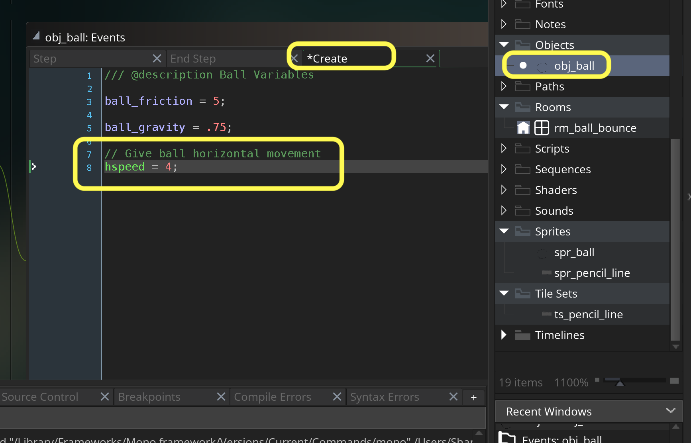
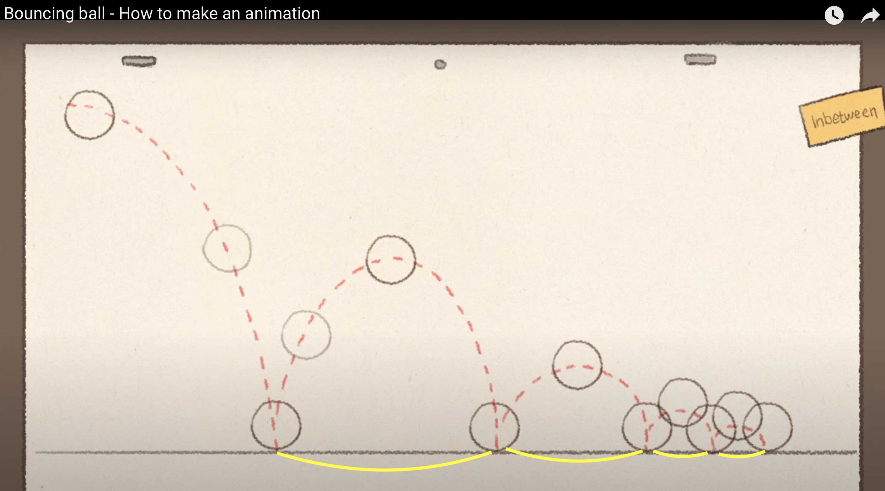
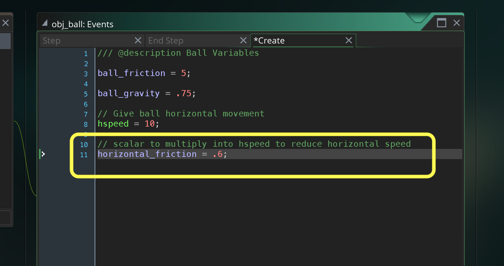

### Horizontal Movement

[previous](../) • [home](../README.md#user-content-gms2-background-tiles--sprites---table-of-contents) • [next](../)

In the video we have the ball moving left to right and our ball is boucing straight up and down.  Lets fix that.

 

---

##### `Step 1.`\|`BTS`|:small_blue_diamond:

Open up **obj_ball | Create Event** and add an **hspeed** of `4`.  This will give it a boost.

##### `Step 2.`\|`BTS`|:small_blue_diamond: :small_blue_diamond: 

Now *press* the <kbd>Play</kbd> button in the top menu bar to launch the game. Woops the ball starts in the center.  Lets move it off screen to the top left then play again.  The ball is not going far enough.  I found an **hspeed** of `10` works best. The ball keeps going off screen but we will add some horizontal ground friction next.

https://user-images.githubusercontent.com/5504953/151790171-9fa117dc-2603-4306-bb73-4d9107e52ded.mp4

##### `Step 3.`\|`BTS`|:small_blue_diamond: :small_blue_diamond: :small_blue_diamond:

Now notice in the traditional animation the ball slows down after each bounce and doesn't go as far.  The friction on the bounce slows down the horizontal speed.

##### `Step 4.`\|`BTS`|:small_blue_diamond: :small_blue_diamond: :small_blue_diamond: :small_blue_diamond:

Now what we will do is reduce the speed by a fraction on each bounce.  Lets open up **obj_ball | Create** event and add a new variable called `horizontal friction` and set it to .

##### `Step 5.`\|`BTS`| :small_orange_diamond:

##### `Step 6.`\|`BTS`| :small_orange_diamond: :small_blue_diamond:

##### `Step 7.`\|`BTS`| :small_orange_diamond: :small_blue_diamond: :small_blue_diamond:

##### `Step 8.`\|`BTS`| :small_orange_diamond: :small_blue_diamond: :small_blue_diamond: :small_blue_diamond:

##### `Step 9.`\|`BTS`| :small_orange_diamond: :small_blue_diamond: :small_blue_diamond: :small_blue_diamond: :small_blue_diamond:

##### `Step 10.`\|`BTS`| :large_blue_diamond:

##### `Step 11.`\|`BTS`| :large_blue_diamond: :small_blue_diamond: 

##### `Step 12.`\|`BTS`| :large_blue_diamond: :small_blue_diamond: :small_blue_diamond: 

##### `Step 13.`\|`BTS`| :large_blue_diamond: :small_blue_diamond: :small_blue_diamond:  :small_blue_diamond: 

##### `Step 14.`\|`BTS`| :large_blue_diamond: :small_blue_diamond: :small_blue_diamond: :small_blue_diamond:  :small_blue_diamond: 

##### `Step 15.`\|`BTS`| :large_blue_diamond: :small_orange_diamond: 

##### `Step 16.`\|`BTS`| :large_blue_diamond: :small_orange_diamond:   :small_blue_diamond: 

##### `Step 17.`\|`BTS`| :large_blue_diamond: :small_orange_diamond: :small_blue_diamond: :small_blue_diamond:

##### `Step 18.`\|`BTS`| :large_blue_diamond: :small_orange_diamond: :small_blue_diamond: :small_blue_diamond: :small_blue_diamond:

##### `Step 19.`\|`BTS`| :large_blue_diamond: :small_orange_diamond: :small_blue_diamond: :small_blue_diamond: :small_blue_diamond: :small_blue_diamond:

##### `Step 20.`\|`BTS`| :large_blue_diamond: :large_blue_diamond:

##### `Step 21.`\|`BTS`| :large_blue_diamond: :large_blue_diamond: :small_blue_diamond:

___

| [previous](../)| [home](../README.md#user-content-gms2-background-tiles--sprites---table-of-contents) | [next](../)|
|---|---|---|
