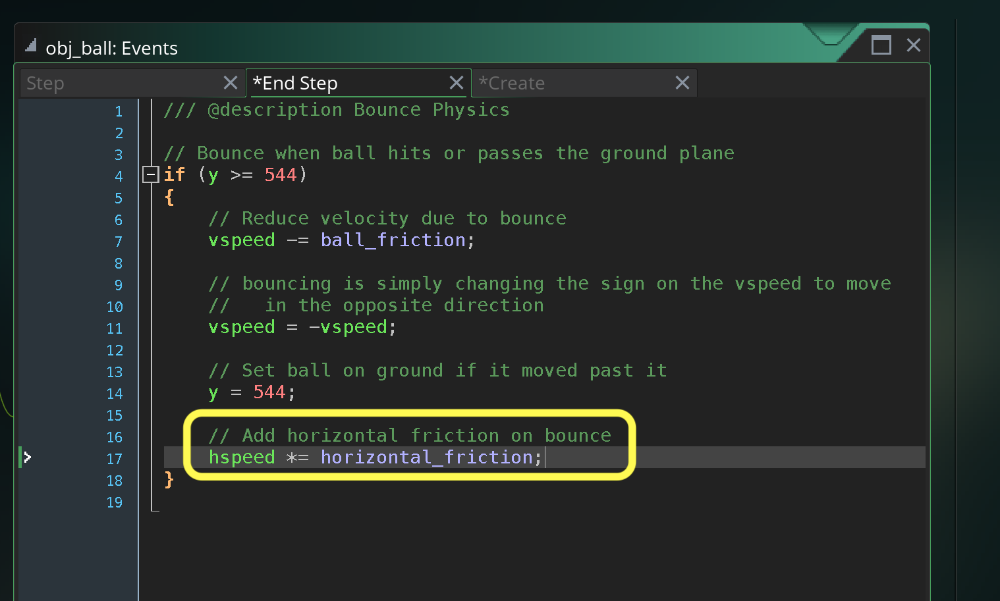
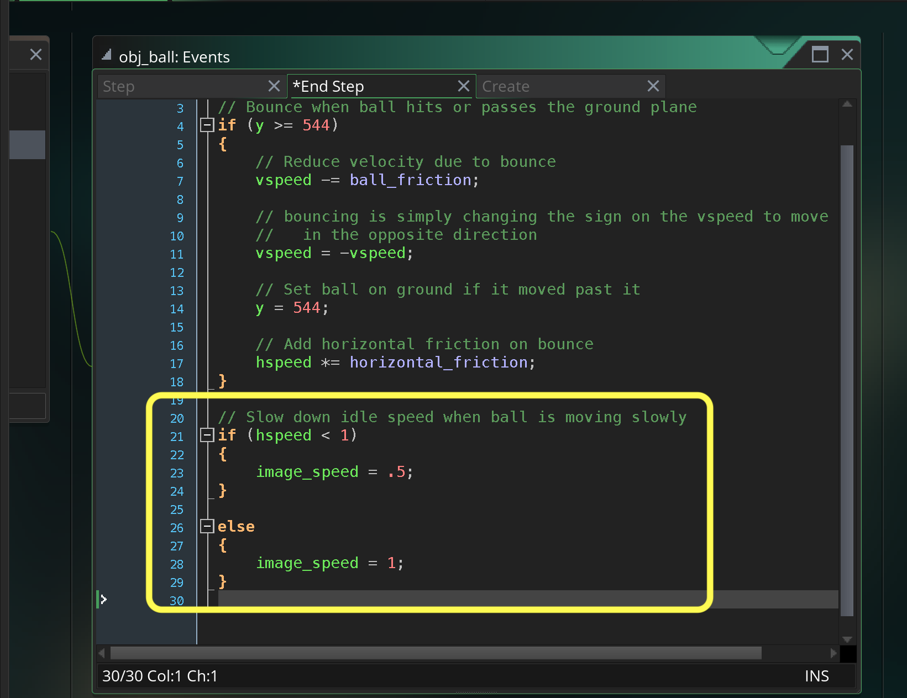

### Horizontal Movement

[previous](../bounce-ball/README.md#user-content-get-ball-to-bounce) • [home](../README.md#user-content-gms2-background-tiles--sprites---table-of-contents) • [next](../squash-stretch/README.md#user-content-squash-and-stretch)

In the video we have the ball moving left to right and our ball is boucing straight up and down.  Lets fix that.

 

---

##### `Step 1.`\|`BTS`|:small_blue_diamond:

Open up **obj_ball | Create Event** and add an **hspeed** of `4`.  This will give it a boost.

##### `Step 2.`\|`BTS`|:small_blue_diamond: :small_blue_diamond: 

Now *press* the <kbd>Play</kbd> button in the top menu bar to launch the game. Woops the ball starts in the center.  Lets move it off screen to the top left then play again.  The ball is not going far enough.  I found an **hspeed** of `10` works best. The ball keeps going off screen but we will add some horizontal ground friction next.

https://user-images.githubusercontent.com/5504953/151790171-9fa117dc-2603-4306-bb73-4d9107e52ded.mp4

##### `Step 3.`\|`BTS`|:small_blue_diamond: :small_blue_diamond: :small_blue_diamond:

Now notice in the traditional animation the ball slows down after each bounce and doesn't go as far.  The friction on the bounce slows down the horizontal speed.

##### `Step 4.`\|`BTS`|:small_blue_diamond: :small_blue_diamond: :small_blue_diamond: :small_blue_diamond:

Now what we will do is reduce the speed by a fraction on each bounce.  Lets open up **obj_ball | Create** event and add a new variable called `horizontal friction` and set it to `0.6`.

##### `Step 5.`\|`BTS`| :small_orange_diamond:

Now everytime the ball collides with the ground reduce the overall speed of the ball.  Go to the **obj_ball | End Step** event and remove 60% of the horizontal speed.

##### `Step 6.`\|`BTS`| :small_orange_diamond: :small_blue_diamond:

Now *press* the <kbd>Play</kbd> button in the top menu bar to launch the game. Notice that the ball comes to a stop at the end of the level, which is what we want!

https://user-images.githubusercontent.com/5504953/151791662-7d8b68f2-6547-4b28-992f-389c74d05be1.mp4

##### `Step 7.`\|`BTS`| :small_orange_diamond: :small_blue_diamond: :small_blue_diamond:

Now to make it perfect it would be nice if the speed of the animation of the ball would slow down when it begins to come to a stop. Lets cut the speed by half when the ball is moving less than a pixel per frame horizontally.

##### `Step 8.`\|`BTS`| :small_orange_diamond: :small_blue_diamond: :small_blue_diamond: :small_blue_diamond:

Now *press* the <kbd>Play</kbd> button in the top menu bar to launch the game. Now that adds a nice touch.  

https://user-images.githubusercontent.com/5504953/151793115-31715c9a-af8a-4ddd-94ba-cdb958087170.mp4

___

| [previous](../bounce-ball/README.md#user-content-get-ball-to-bounce)| [home](../README.md#user-content-gms2-background-tiles--sprites---table-of-contents) | [next](../squash-stretch/README.md#user-content-squash-and-stretch)|
|---|---|---|
