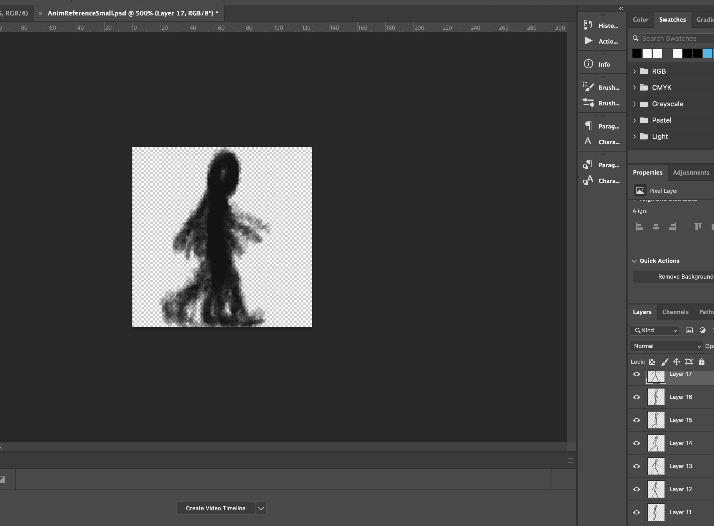
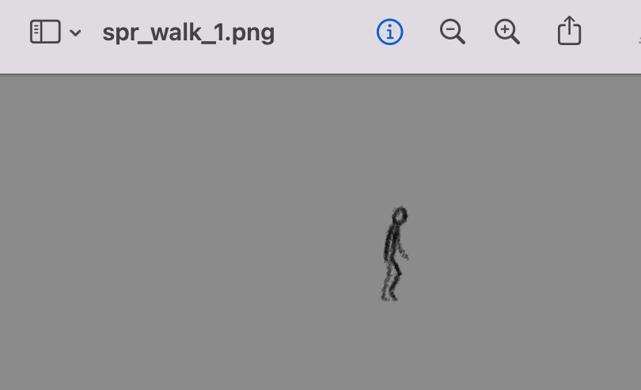
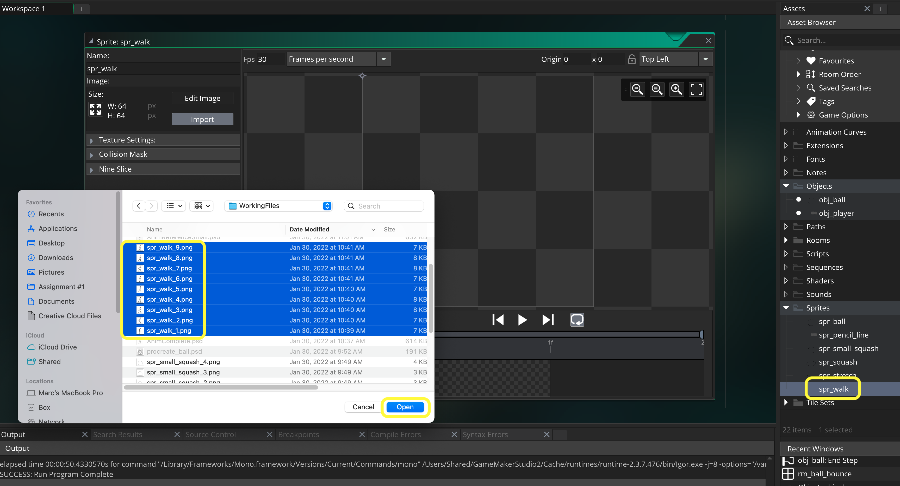
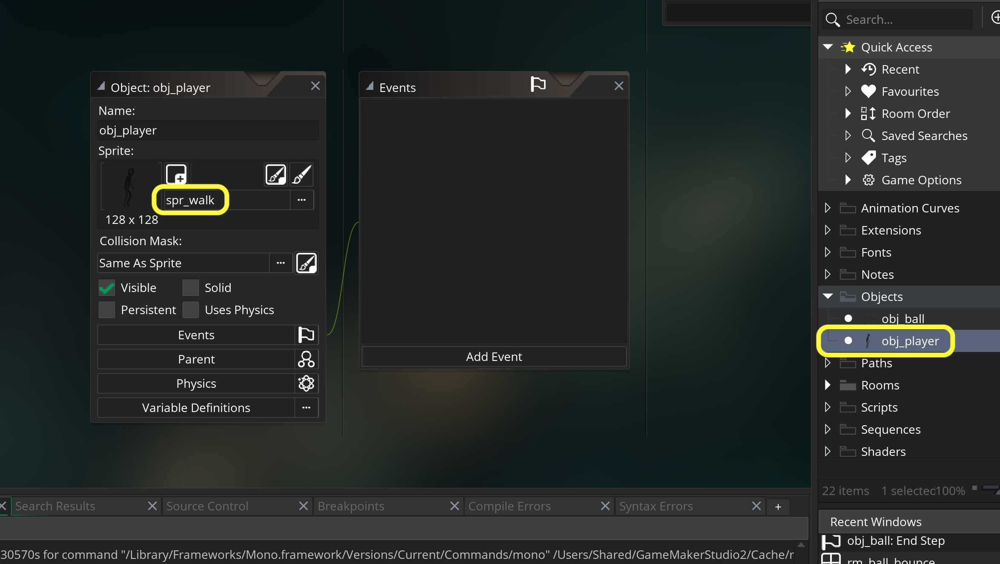
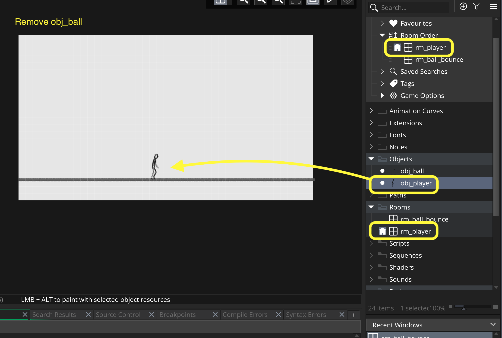
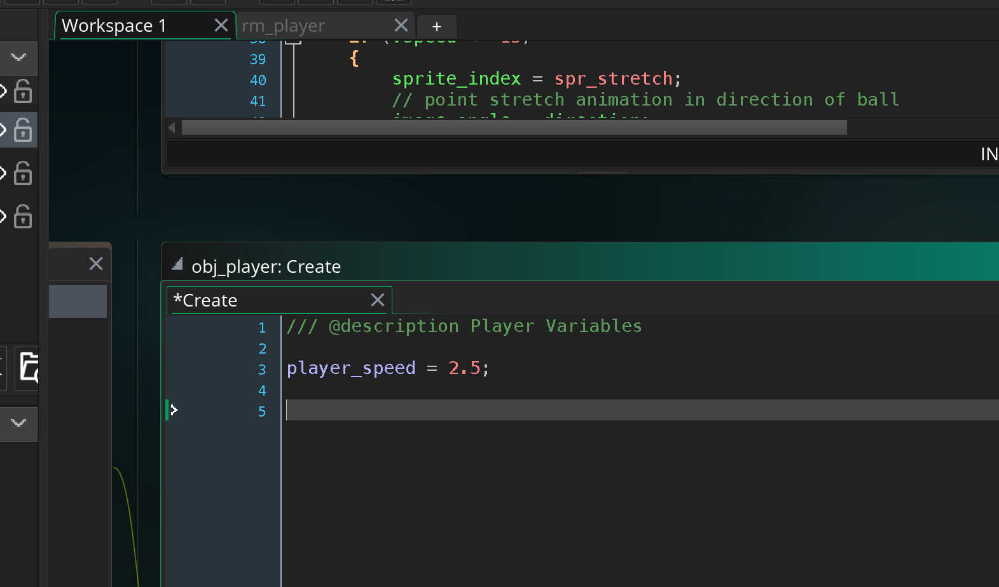
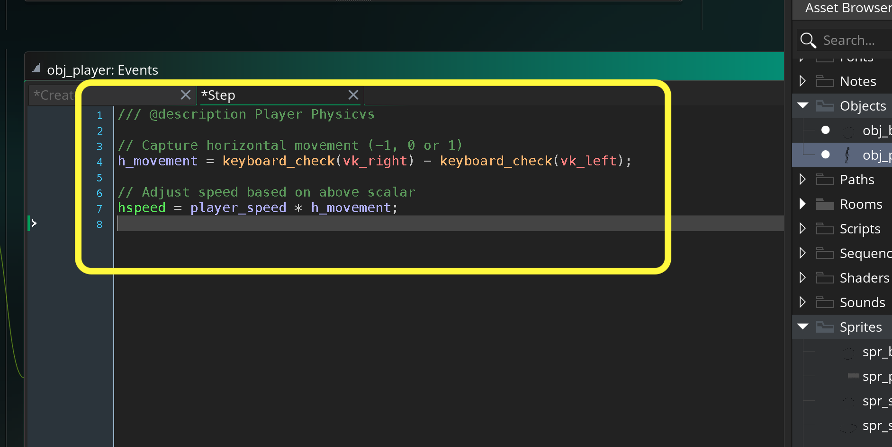
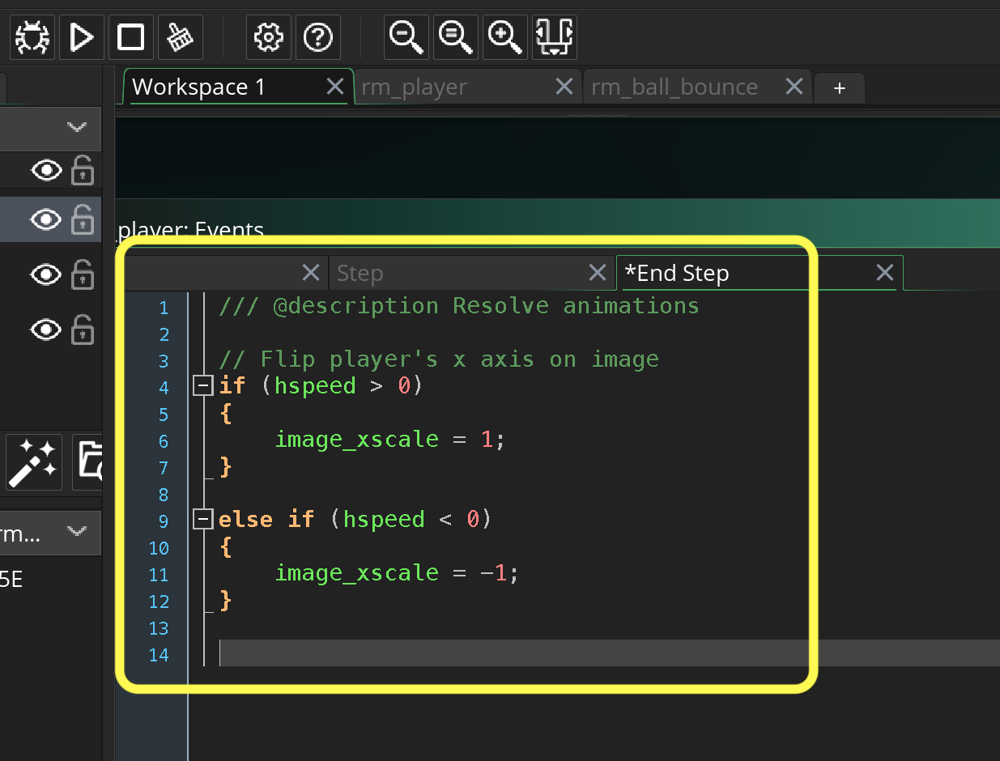
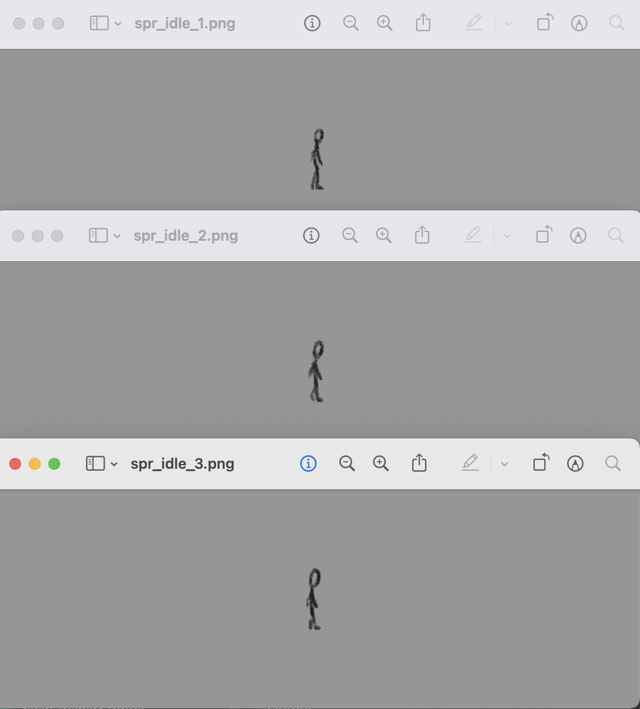
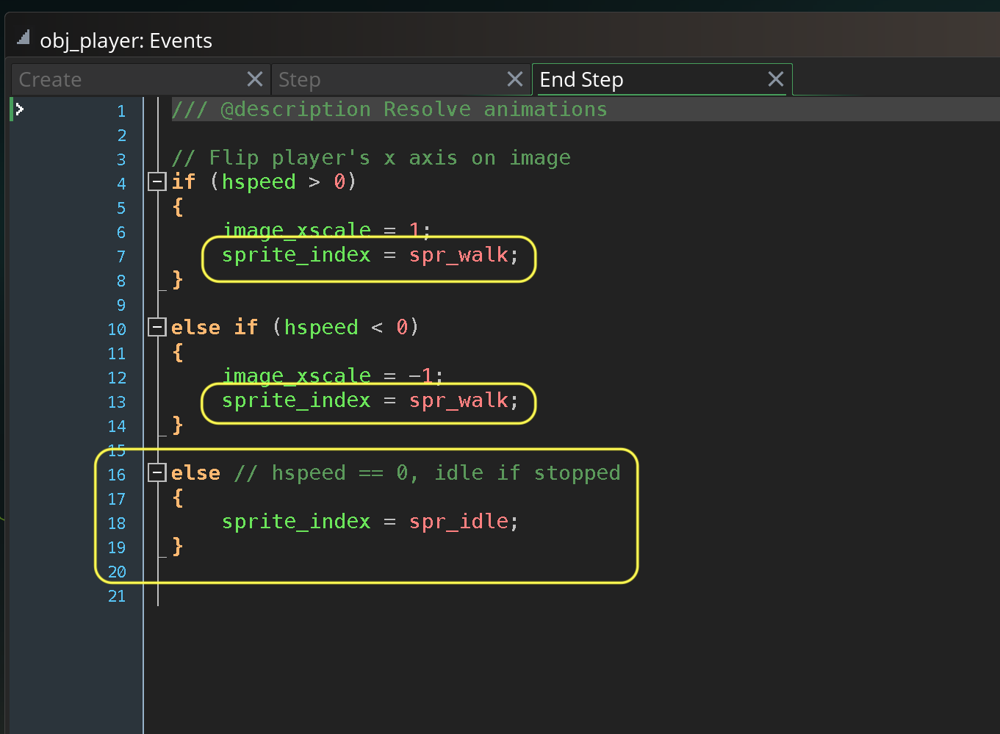

### Animating a Run Cycle

[previous](../squash-stretch-ii/README.md#user-content-squash-and-stretch-ii) • [home](../README.md#user-content-gms2-background-tiles--sprites---table-of-contents) • [next](../animation-tips/README.md#user-content-animation-tips)

Now lets try and animate a walk cycle we can use in the game. This is for a platformer side view.  So I found reference of a person walking who is directly at 90 degrees from the camera.

 

---

##### `Step 1.`\|`BTS`|:small_blue_diamond:

It is always good when making your first walk cycle to use some reference.  In this case we will be tracing a stick person animation.  Just like the ball for walking/running we need to animate the player without translation (like running on a treadmill).  There is lots of good reference on YouTube.  Lets use this one. Click on the picture below to view the video on YouTube.

##### `Step 2.`\|`BTS`|:small_blue_diamond: :small_blue_diamond: 

For reference I took screenshot of every 10th frames of the animation.  This resulted in a 9 frame walk cycle.  I took it with 1 frame less than a full walk cycle (right foot swinghing forward below hip all the way to right foot 1 frame before right hip).  If you loop it creates a seamless walk cycle. I scaled down the sequence but left it larger than I want in the game for more precision pencil work (I will scale it down to game size later). You can download the [AnimReference.psd file here](images/AnimReference.psd). 

##### `Step 3.`\|`BTS`|:small_blue_diamond: :small_blue_diamond: :small_blue_diamond:

I used procreate on an iPad but you can use Photoshop or countless other paint packages.  It is best to use a tablet again for animation.  I added a white layer on top of the first layer.  I changed the opactity to about 70%. This allows me to see the drawing while still able to see the pose for tracing.

##### `Step 4.`\|`BTS`|:small_blue_diamond: :small_blue_diamond: :small_blue_diamond: :small_blue_diamond:

Then I traced a stick-person on top of each pose on its own layer above the white one.  I tried to keep the forward limbs a bit darker than the back leg and arm.

##### `Step 5.`\|`BTS`| :small_orange_diamond:

Now I move the white tracing layer up and add a layer for the remaining 8 frames and get a pose drawn for each reference frame. 

https://user-images.githubusercontent.com/5504953/152154007-f5998b7a-2943-4e12-ba9c-f9536d02a9e6.mp4

##### `Step 6.`\|`BTS`| :small_orange_diamond: :small_blue_diamond:

Remove all reference, white and any background.  You should just have 8 transparent layers.  Trim the image and change the longest side to `128`. Then adjust the canvas to `128` so we get a square frame.  Make sure the feet are at the very bottom of the frame.

##### `Step 7.`\|`BTS`| :small_orange_diamond: :small_blue_diamond: :small_blue_diamond:

Export each frame as a `.png` file naming them `spr_walk_1` to `spr_walk_9`.

##### `Step 8.`\|`BTS`| :small_orange_diamond: :small_blue_diamond: :small_blue_diamond: :small_blue_diamond:

Create a new sprite called `spr_walk` and press the <kbd>Import</kbd> button.  Import the 9 animation frames.

##### `Step 9.`\|`BTS`| :small_orange_diamond: :small_blue_diamond: :small_blue_diamond: :small_blue_diamond: :small_blue_diamond:

Adjust the **FPS** (Frames per Second) to a speed that looks right to you.  I selected `12`.

https://user-images.githubusercontent.com/5504953/152157005-97dffc82-d01c-4595-81de-682d20bd5693.mp4

##### `Step 10.`\|`BTS`| :large_blue_diamond:

*Right click* on **Objects** and select **New | Object** and name it `obj_player`. Set the **Sprite** to `spr_walk`.

##### `Step 11.`\|`BTS`| :large_blue_diamond: :small_blue_diamond: 
 
 *Right click* on **rm_ball_bounce** and select **Duplicate** and name it `rm_player`. Change the **Room Order** to place this room on the top of the list. Remove `obj_ball` and add `obj_player` to the center room on the floor.

##### `Step 12.`\|`BTS`| :large_blue_diamond: :small_blue_diamond: :small_blue_diamond: 

Now *press* the <kbd>Play</kbd> button in the top menu bar to launch the game. Now we can see our animation in game!

https://user-images.githubusercontent.com/5504953/152159169-c55a937c-05c0-4a11-add0-d5f419530dd7.mp4

##### `Step 13.`\|`BTS`| :large_blue_diamond: :small_blue_diamond: :small_blue_diamond:  :small_blue_diamond: 

Press the <kbd>Add Event</kbd> and select a **Create** event. Now lets add a speed in pixels per frame for the animation to translate it along the x axis.

##### `Step 14.`\|`BTS`| :large_blue_diamond: :small_blue_diamond: :small_blue_diamond: :small_blue_diamond:  :small_blue_diamond: 

Press the <kbd>Add Event</kbd> and select a **Step | Step** event. We then get left and right movement by creating a scalar.  We subtract two booleans `keyboard_check(vk_right) - keyboard_check(vk_left)`.  Since `keyboard_check(key)` returns a boolean (1 - true, 0 - false) we get 1 - 0, 1 - 1, 0 - 1, 0 - 0 as possible outcomes.  This gives a a scalar of -1, 0 or 1.  We can then multiply our `player_speed` by `h_movement` to translate left and right. 

##### `Step 15.`\|`BTS`| :large_blue_diamond: :small_orange_diamond: 

Now *press* the <kbd>Play</kbd> button in the top menu bar to launch the game. Now press left and right and you can move the player.  The player is not turning to face the direction they are walking in.

https://user-images.githubusercontent.com/5504953/152334584-71a29f82-33df-4e93-9836-1b30e7845141.mp4

##### `Step 16.`\|`BTS`| :large_blue_diamond: :small_orange_diamond:   :small_blue_diamond: 

We can get the mirror image of the sprite so that it faces left by inverting the horizontal scale.  If you set `image_xscale` to `-1` then you will create a mirror image or the original direction, so the player will face left.  So when `hspeed` is negative, make the sprite face left otherwise if the `speed` is positive make it face right.  

Now we want to do this after the player has moved (and if there were collisions after we resolved collisions).  Press the <kbd>Add Event</kbd> and select a **Step | End Step** event. 

##### `Step 17.`\|`BTS`| :large_blue_diamond: :small_orange_diamond: :small_blue_diamond: :small_blue_diamond:

Now *press* the <kbd>Play</kbd> button in the top menu bar to launch the game. We now face the direction we are walking in.  But if I let go the player keeps walking.

https://user-images.githubusercontent.com/5504953/152335802-7488641c-60d1-4036-8613-cca144c96b8d.mp4

##### `Step 18.`\|`BTS`| :large_blue_diamond: :small_orange_diamond: :small_blue_diamond: :small_blue_diamond: :small_blue_diamond:

Now draw three frames of the player standing.  The different pencil strokes will create some changes and add life when animating. You can trace/draw the first pose then draw two others on top of it.  Export them as `spr_idle_1.png`, `spr_idle_2.png` and `spr_idle_3.png`.

##### `Step 19.`\|`BTS`| :large_blue_diamond: :small_orange_diamond: :small_blue_diamond: :small_blue_diamond: :small_blue_diamond: :small_blue_diamond:

Now add a switch to the **spr_idle** when the player is not moving (if the player's hspeed is neither above or below 0 then the final else has to be a value of 0, or the player idling).  We also have to swtich back to the walk animation when the user moves the player again.

##### `Step 20.`\|`BTS`| :large_blue_diamond: :large_blue_diamond:

Now *press* the <kbd>Play</kbd> button in the top menu bar to launch the game. Now I forgot to adjust the **Origin** of the sprite.  So the player shifts **y** position when changing states.  Open up `spr_player` and set the **Origin** to `Bottom Center`.  Press he <kbd>Play</kbd> button again, and we have it working correctly.

https://user-images.githubusercontent.com/5504953/152337340-9e898854-5417-4a18-9d5a-fc4130628a1f.mp4

___

| [previous](../squash-stretch-ii/README.md#user-content-squash-and-stretch-ii)| [home](../README.md#user-content-gms2-background-tiles--sprites---table-of-contents) | [next](../animation-tips/README.md#user-content-animation-tips)|
|---|---|---|
