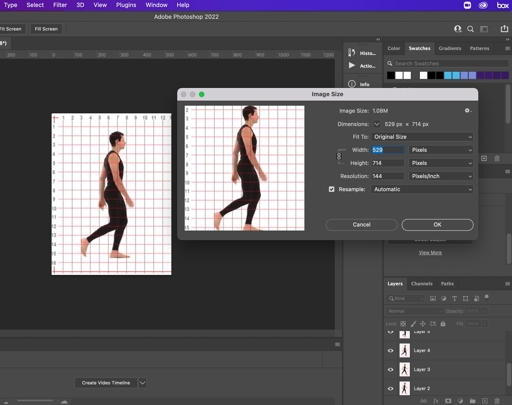
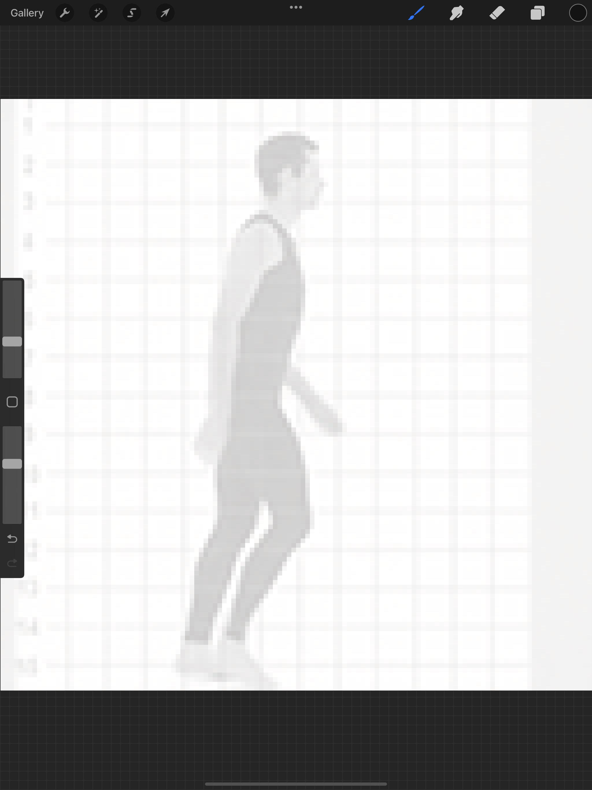
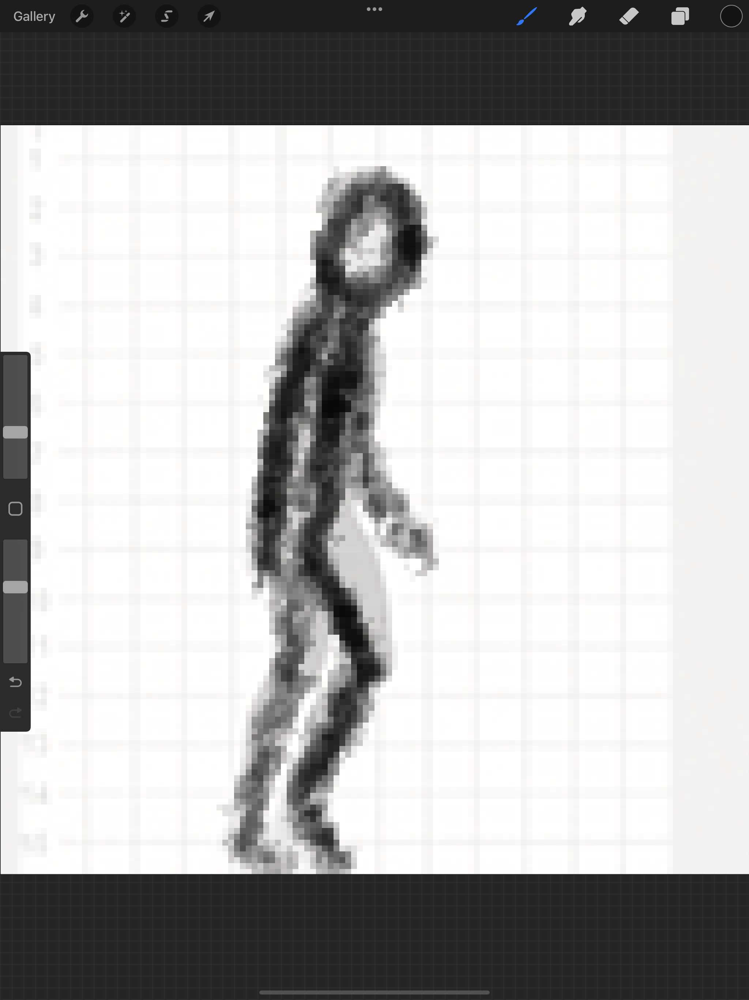

### Animating a Run Cycle

[previous](../) • [home](../README.md#user-content-gms2-background-tiles--sprites---table-of-contents) • [next](../)

Now lets try and animate a walk cycle we can use in the game. This is for a platformer side view.  So I found reference of a person walking who is directly at 90 degrees from the camera.

 

---

##### `Step 1.`\|`BTS`|:small_blue_diamond:

It is always good when making your first walk cycle to use some reference.  In this case we will be tracing a stick person animation.  Just like the ball for walking/running we need to animate the player without translation (like running on a treadmill).  There is lots of good reference on YouTube.  Lets use this one. Click on the picture below to view the video on YouTube.

##### `Step 2.`\|`BTS`|:small_blue_diamond: :small_blue_diamond: 

For reference I took screenshot of every 10th frames of the animation.  This resulted in a 9 frame walk cycle.  I took it with 1 frame less than a full walk cycle (right foot swinghing forward below hip all the way to right foot 1 frame before right hip).  If you loop it creates a seamless walk cycle. I scaled down the sequence but left it larger than I want in the game for more precision pencil work (I will scale it down to game size later). You can download the [AnimReference.psd file here](images/AnimReference.psd). 

##### `Step 3.`\|`BTS`|:small_blue_diamond: :small_blue_diamond: :small_blue_diamond:

I used procreate on an iPad but you can use Photoshop or countless other paint packages.  It is best to use a tablet again for animation.  I added a white layer on top of the first layer.  I changed the opactity to about 70%. This allows me to see the drawing while still able to see the pose for tracing.

##### `Step 4.`\|`BTS`|:small_blue_diamond: :small_blue_diamond: :small_blue_diamond: :small_blue_diamond:

Then I traced a stick-person on top of each pose on its own layer above the white one.  I tried to keep the forward limbs a bit darker than the back leg and arm.

##### `Step 5.`\|`BTS`| :small_orange_diamond:

Now I move the white tracing layer up and add a layer for the remaining 8 frames and get a pose drawn for each reference frame. 

https://user-images.githubusercontent.com/5504953/152154007-f5998b7a-2943-4e12-ba9c-f9536d02a9e6.mp4

##### `Step 6.`\|`BTS`| :small_orange_diamond: :small_blue_diamond:

##### `Step 7.`\|`BTS`| :small_orange_diamond: :small_blue_diamond: :small_blue_diamond:

##### `Step 8.`\|`BTS`| :small_orange_diamond: :small_blue_diamond: :small_blue_diamond: :small_blue_diamond:

##### `Step 9.`\|`BTS`| :small_orange_diamond: :small_blue_diamond: :small_blue_diamond: :small_blue_diamond: :small_blue_diamond:

##### `Step 10.`\|`BTS`| :large_blue_diamond:

##### `Step 11.`\|`BTS`| :large_blue_diamond: :small_blue_diamond: 

##### `Step 12.`\|`BTS`| :large_blue_diamond: :small_blue_diamond: :small_blue_diamond: 

##### `Step 13.`\|`BTS`| :large_blue_diamond: :small_blue_diamond: :small_blue_diamond:  :small_blue_diamond: 

##### `Step 14.`\|`BTS`| :large_blue_diamond: :small_blue_diamond: :small_blue_diamond: :small_blue_diamond:  :small_blue_diamond: 

##### `Step 15.`\|`BTS`| :large_blue_diamond: :small_orange_diamond: 

##### `Step 16.`\|`BTS`| :large_blue_diamond: :small_orange_diamond:   :small_blue_diamond: 

##### `Step 17.`\|`BTS`| :large_blue_diamond: :small_orange_diamond: :small_blue_diamond: :small_blue_diamond:

##### `Step 18.`\|`BTS`| :large_blue_diamond: :small_orange_diamond: :small_blue_diamond: :small_blue_diamond: :small_blue_diamond:

##### `Step 19.`\|`BTS`| :large_blue_diamond: :small_orange_diamond: :small_blue_diamond: :small_blue_diamond: :small_blue_diamond: :small_blue_diamond:

##### `Step 20.`\|`BTS`| :large_blue_diamond: :large_blue_diamond:

##### `Step 21.`\|`BTS`| :large_blue_diamond: :large_blue_diamond: :small_blue_diamond:

___

| [previous](../)| [home](../README.md#user-content-gms2-background-tiles--sprites---table-of-contents) | [next](../)|
|---|---|---|
