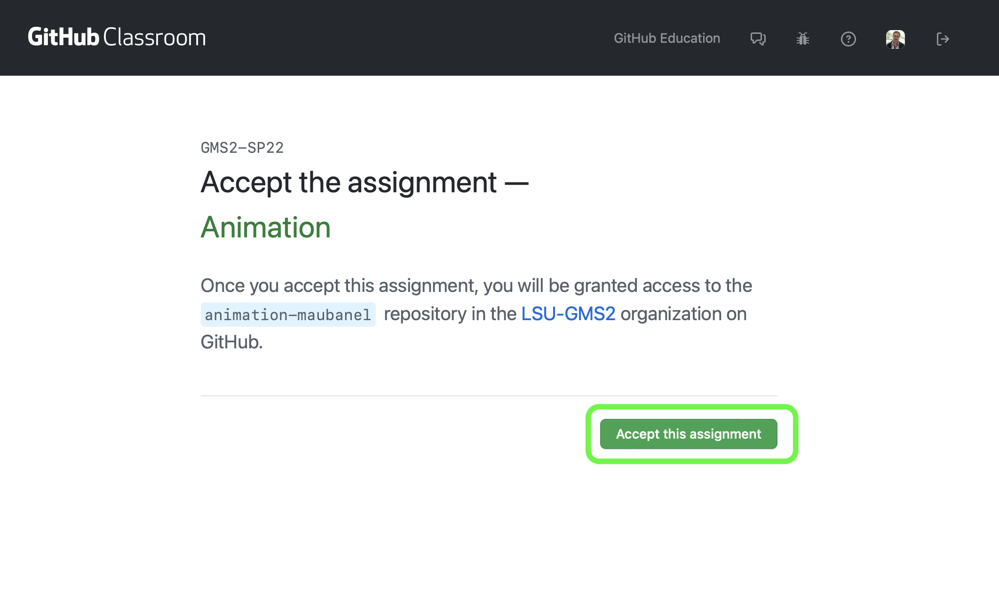
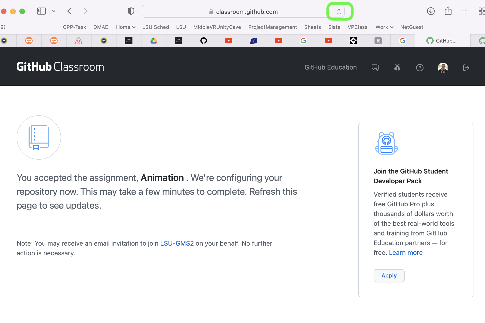
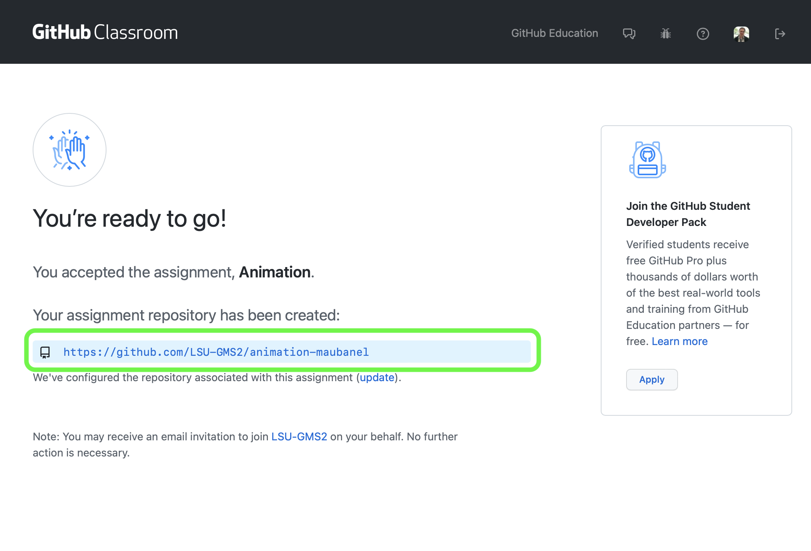
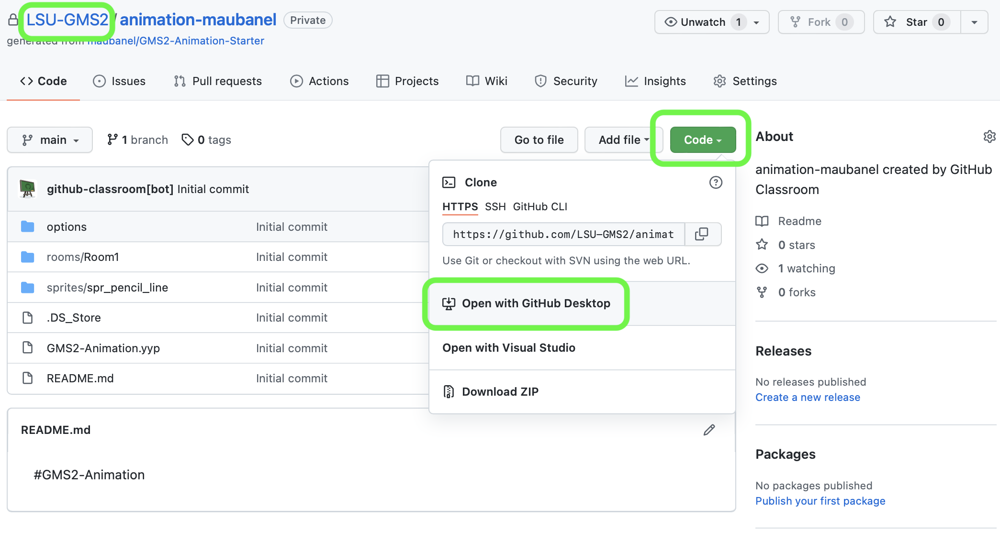
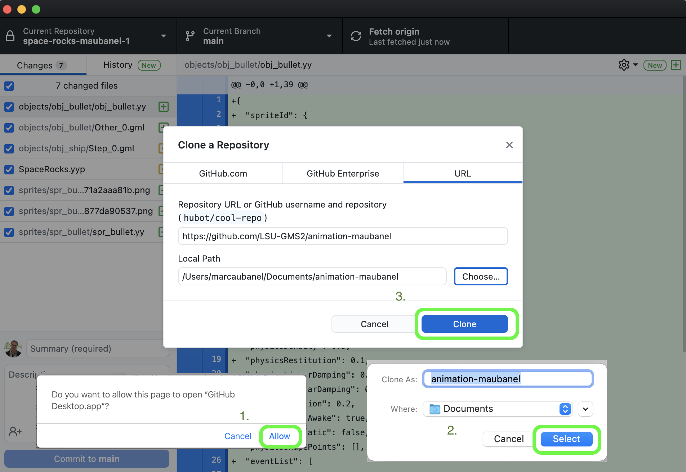
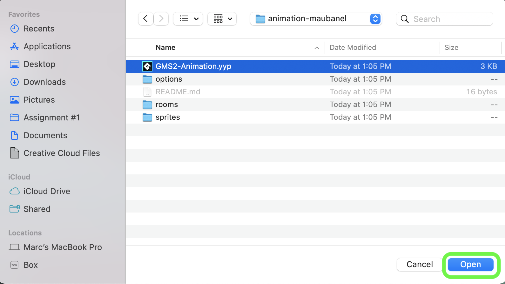
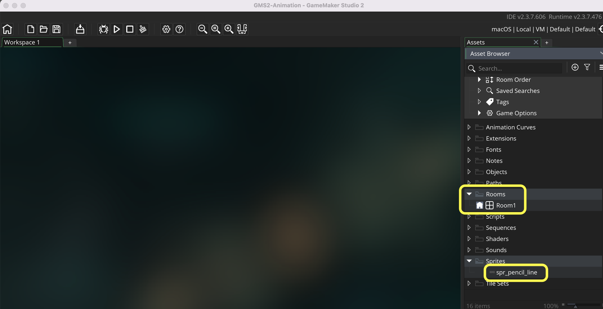
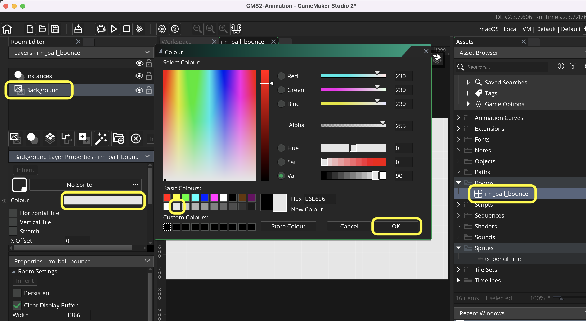
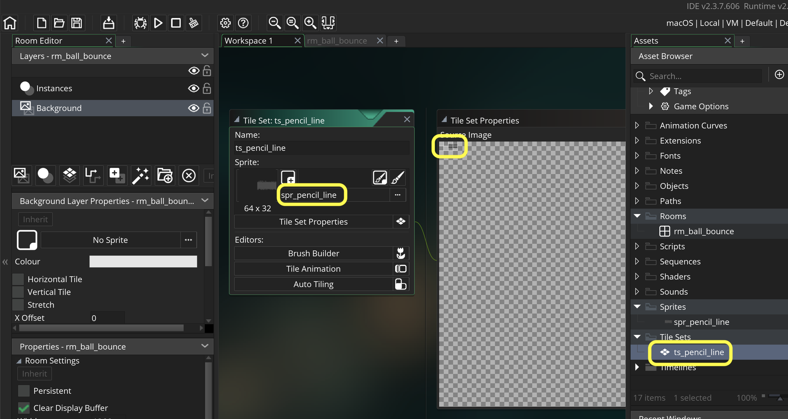

### Setting Up

[home](../README.md#user-content-gms2-background-tiles--sprites---table-of-contents) • [next](../)

Lets look at a ball animation and start the project up.

 

---

##### `Step 1.`\|`BTS`|:small_blue_diamond:

Please click and watch this video on how an animator would go about animating a 2-d ball using traditional techniques.

##### `Step 2.`\|`BTS`|:small_blue_diamond: :small_blue_diamond: 

Accept the **[Git Hub Classroom Link](https://classroom.github.com/a/C3wXzkmi)** with the starter project. Press the <kbd>Accept this assignment</kbd> button.

##### `Step 3.`\|`BTS`|:small_blue_diamond: :small_blue_diamond: :small_blue_diamond:

Now you will go to a screen that says it will take some time to create the project.  Press the refresh on your browser and you will see a link to your newly created **GitHub** repository.  Click the link.  The press the <kbd>Code</kbd> button and select `Open with GitHub Desktop`.

##### `Step 4.`\|`BTS`|:small_blue_diamond: :small_blue_diamond: :small_blue_diamond: :small_blue_diamond:

Now you give the app permission and select the directory of where you would like to clone.  When you decide press the <kbd>Clone</kbd> button.

##### `Step 5.`\|`BTS`| :small_orange_diamond:

Navigate to the project and open **GMS2-Animation.yyp**.

##### `Step 6.`\|`BTS`| :small_orange_diamond: :small_blue_diamond:

Now you have a basic empty **GML** project with a **Room0** and a sprite for a tile to mimic the line in the video above.

##### `Step 7.`\|`BTS`| :small_orange_diamond: :small_blue_diamond: :small_blue_diamond:

Rename the room to `rm_ball_bounce`. Open the room up and select the **Background** layer.  *Double click* the **Colour** button and select the second most **white** white.  I don't like picking pure white for an entire background as it is too much on the eyes.

##### `Step 8.`\|`BTS`| :small_orange_diamond: :small_blue_diamond: :small_blue_diamond: :small_blue_diamond:

*Right click* on **Tiles** and select **New | Tile** and name it `ts_pencil_line`.

##### `Step 9.`\|`BTS`| :small_orange_diamond: :small_blue_diamond: :small_blue_diamond: :small_blue_diamond: :small_blue_diamond:

Go back to the room and press the <kbd>Tile Layer<kbd> button.  Call it `Ground`.  Select `ts_pencil_line` as the tileset.

##### `Step 10.`\|`BTS`| :large_blue_diamond:

Select the tile layer and the pencil tool and start to draw a line along the bottom of the screen. Now *press* the <kbd>Play</kbd> button in the top menu bar to launch the game.

##### `Step 11.`\|`BTS`| :large_blue_diamond: :small_blue_diamond: 

##### `Step 12.`\|`BTS`| :large_blue_diamond: :small_blue_diamond: :small_blue_diamond: 

##### `Step 13.`\|`BTS`| :large_blue_diamond: :small_blue_diamond: :small_blue_diamond:  :small_blue_diamond: 

##### `Step 14.`\|`BTS`| :large_blue_diamond: :small_blue_diamond: :small_blue_diamond: :small_blue_diamond:  :small_blue_diamond: 

##### `Step 15.`\|`BTS`| :large_blue_diamond: :small_orange_diamond: 

##### `Step 16.`\|`BTS`| :large_blue_diamond: :small_orange_diamond:   :small_blue_diamond: 

##### `Step 17.`\|`BTS`| :large_blue_diamond: :small_orange_diamond: :small_blue_diamond: :small_blue_diamond:

##### `Step 18.`\|`BTS`| :large_blue_diamond: :small_orange_diamond: :small_blue_diamond: :small_blue_diamond: :small_blue_diamond:

##### `Step 19.`\|`BTS`| :large_blue_diamond: :small_orange_diamond: :small_blue_diamond: :small_blue_diamond: :small_blue_diamond: :small_blue_diamond:

##### `Step 20.`\|`BTS`| :large_blue_diamond: :large_blue_diamond:

##### `Step 21.`\|`BTS`| :large_blue_diamond: :large_blue_diamond: :small_blue_diamond:

___

[home](../README.md#user-content-gms2-background-tiles--sprites---table-of-contents) | [next](../)|
|---|---|
