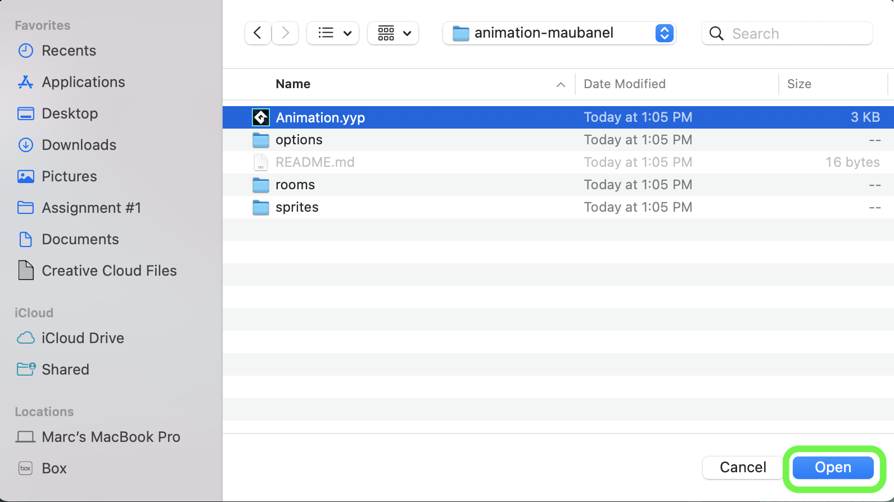
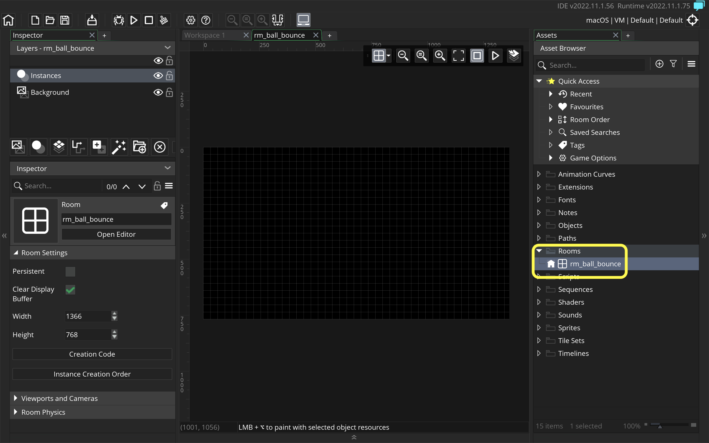
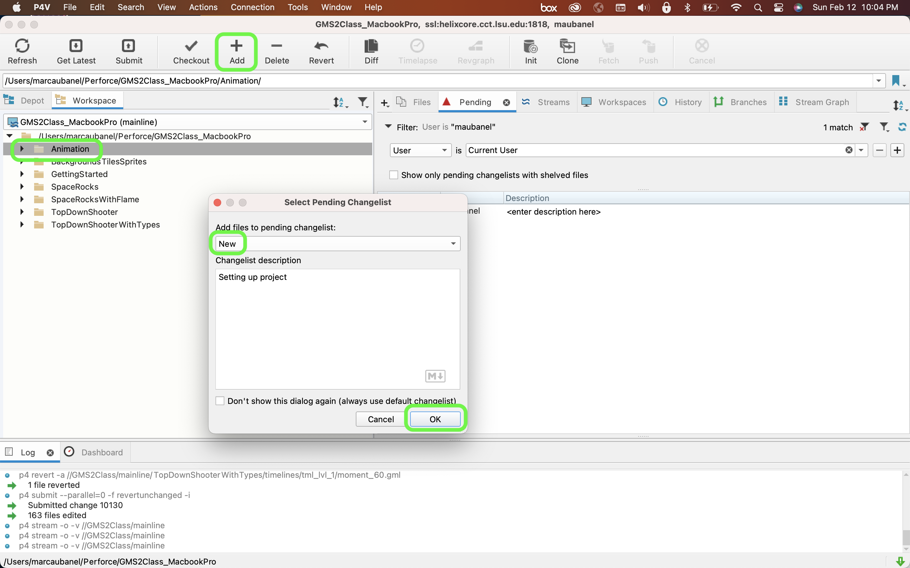

### Setting Up

[home](../README.md#user-content-gms2-animation---table-of-contents) • [next](../bounce-ball/README.md#user-content-get-ball-to-bounce)

Lets look at a ball animation and start the project up.

 

---

##### `Step 1.`\|`ANIM`|:small_blue_diamond:

Please click and watch this video on how an animator would go about animating a 2-d ball using traditional techniques.

##### `Step 2.`\|`ANIM`|:small_blue_diamond: :small_blue_diamond: 

Pres the <kbd>New</kbd> then the <kbd>New Blank</kbd> to create a new blank project. Call the project `Animation`. Put it in the same folder that contains your **Perforce** repository. It should appear in the same folder as the first project **Getting Started**, **Space Rocks** and **Backgrounds**. Select this directory by pressing the <kbd>Open</kbd> button. Press the <kbd>Lets Go!</kbd> button to start our new project.

##### `Step 3.`\|`ANIM`|:small_blue_diamond: :small_blue_diamond: :small_blue_diamond:

Navigate to the project and open **GMS2-Animation.yyp**.

##### `Step 4.`\|`ANIM`|:small_blue_diamond: :small_blue_diamond: :small_blue_diamond: :small_blue_diamond:

Now you should have an empty game with the defaul room! Change the room name to `rm_ball_bounce`.

##### `Step 5.`\|`ANIM`| :small_orange_diamond:

 Open the room up and select the **Background** layer.  *Double click* the **Colour** button and select the second most **white** white.  I don't like picking pure white for an entire background as it is too much on the eyes.

##### `Step 6.`\|`ANIM`| :small_orange_diamond: :small_blue_diamond:

Download [spr_line.png](../assets/spr_line.png) onto your local hard drive.

##### `Step 7.`\|`ANIM`| :small_orange_diamond: :small_blue_diamond: :small_blue_diamond:

*Right click* on **Tiles** and select **New | Tile** and name it `ts_pencil_line`.

##### `Step 8.`\|`ANIM`| :small_orange_diamond: :small_blue_diamond: :small_blue_diamond: :small_blue_diamond:

Open up the new tileset and assign `spr_line`.  Change the **Tile Height** and **Tile Width** to `32`.

##### `Step 9.`\|`ANIM`| :small_orange_diamond: :small_blue_diamond: :small_blue_diamond: :small_blue_diamond: :small_blue_diamond:

Go back to the room and press the <kbd>Tile Layer</kbd> button.  Call it `Ground`.  Select `ts_pencil_line` as the tileset.

##### `Step 10.`\|`ANIM`| :large_blue_diamond:

Select the tile layer and the pencil tool and start to draw a line along the bottom of the screen. Now *press* the <kbd>Play</kbd> button in the top menu bar to launch the game. You should have a white-ish background with a pencil line ground plane at the bottom (I drew it in **ProCreate** on my ipad).

https://user-images.githubusercontent.com/5504953/151715425-c6bfc3bb-72eb-4079-b7fa-c0cef79956e2.mp4

Open up **P4V**.  Select the top folder and press the **Add** button.  We want to add all the new files we created during this last session.  Add these files to the last change list you used at the begining of the session (in my case it was `Spaceship I portion of walkthrough`). Press the <kbd>OK</kbd> button.

##### `Step 11.`\|`ANIM`| :large_blue_diamond: :small_blue_diamond: 
Now you can submit the changelist by pressing both <kbd>Submit</kbd> buttons.

___

<!--  -->

[home](../README.md#user-content-gms2-animation---table-of-contents) | [next](../bounce-ball/README.md#user-content-get-ball-to-bounce)|
|---|---|
