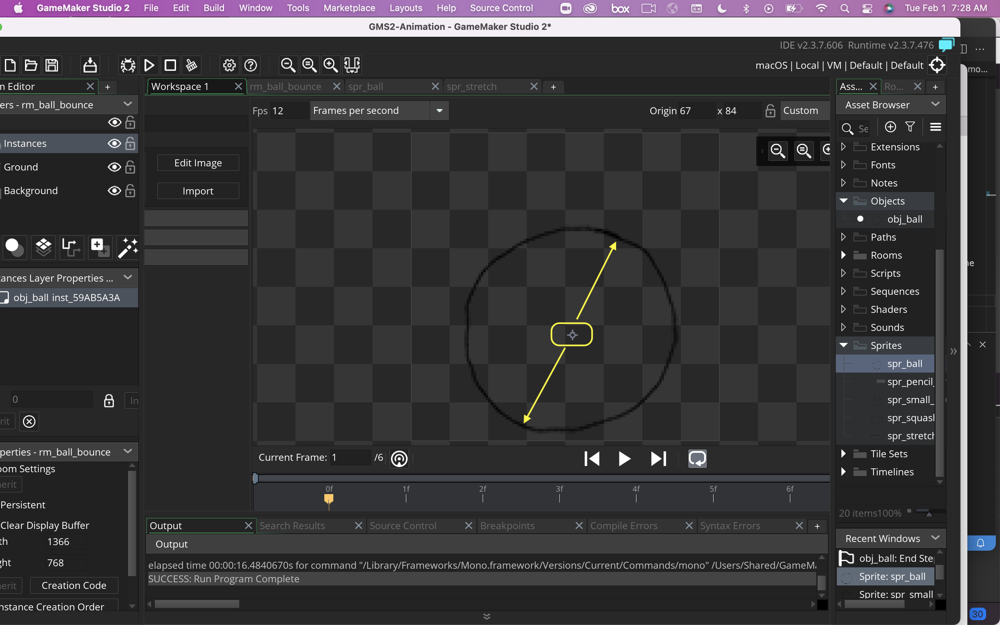
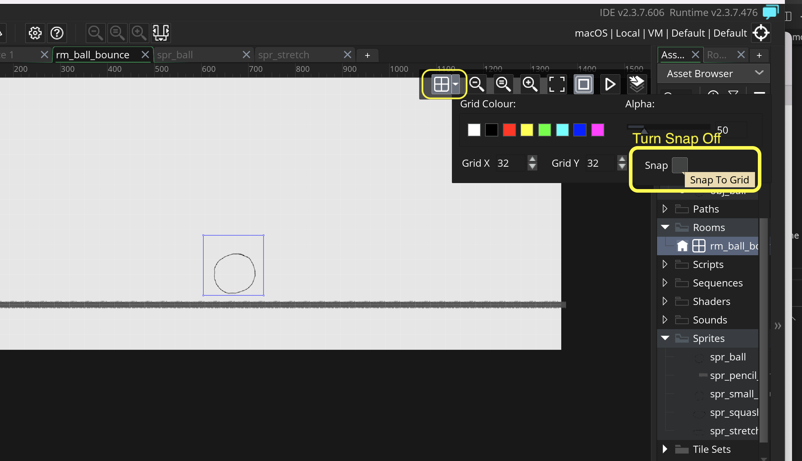
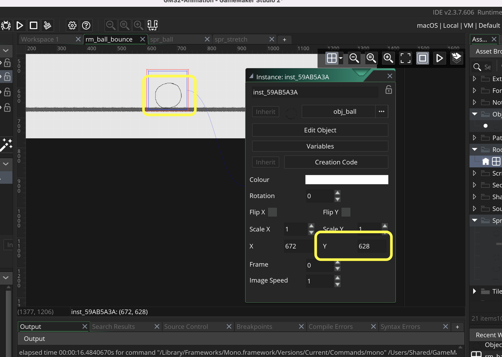
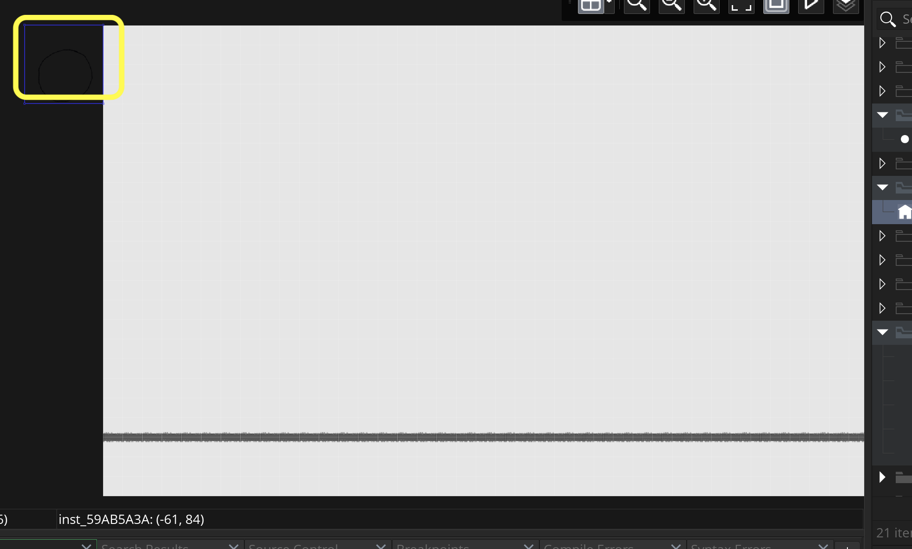
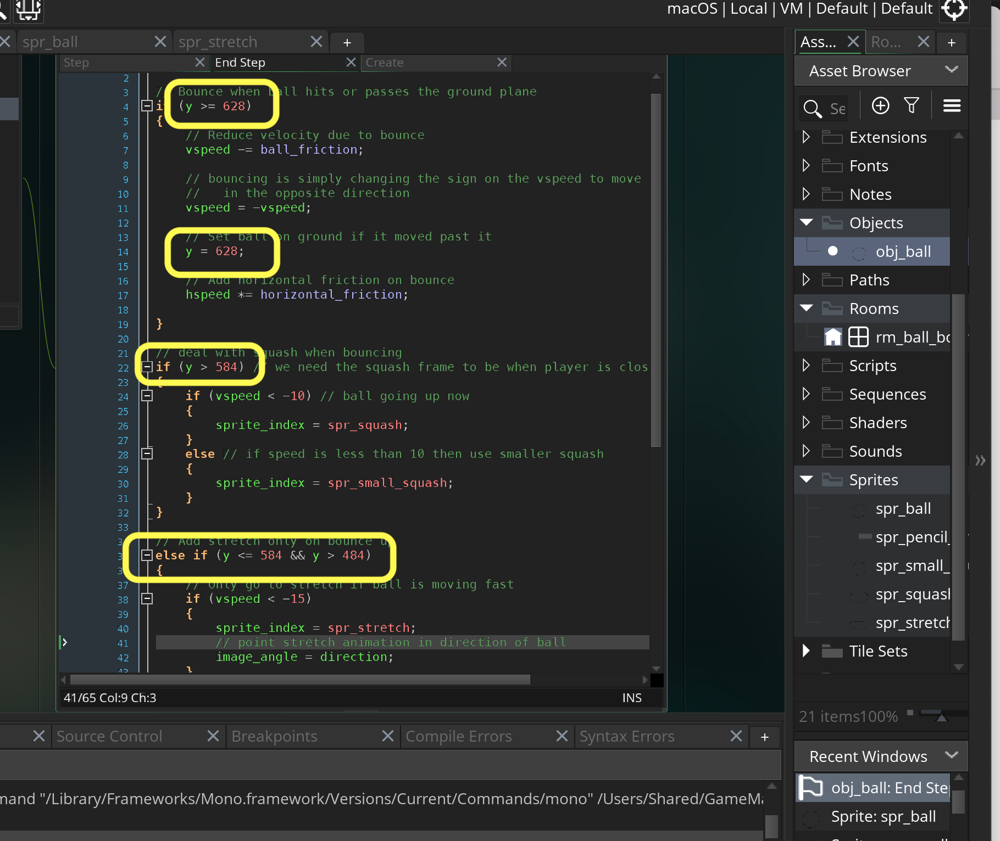

### Squash and Stretch II

[previous](../) • [home](../README.md#user-content-gms2-background-tiles--sprites---table-of-contents) • [next](../)

Lets finish off squash and stretch by addin stretch.

 

---

##### `Step 1.`\|`BTS`|:small_blue_diamond:

The final step in the video is adding stretch when the ball bounces up.  It should only be used on the high bounces (first two).

##### `Step 2.`\|`BTS`|:small_blue_diamond: :small_blue_diamond: 

Now in your paint package we will draw 3 stretch frames.  Now it should be pointing the direction it is bouncing in.  We should do this in code.  So we should draw it with the forward direction pointing right.  It should look like so: 

##### `Step 3.`\|`BTS`|:small_blue_diamond: :small_blue_diamond: :small_blue_diamond:

So the final set of frames of the balls should include the ball, the squash and three stretch frames.

##### `Step 4.`\|`BTS`|:small_blue_diamond: :small_blue_diamond: :small_blue_diamond: :small_blue_diamond:

Now remove the background and trim, scale and resize canvas to `128` by `128`.  Now the ball size has shrunk because of the long stretch piece.  I will need to re-export all the ball frames to `.png` to maintain scale. The stretch animations are exported as `spr_stretch_1.png`, `spr_stretch_2.png`, `spr_stretch_3.png`.

##### `Step 5.`\|`BTS`| :small_orange_diamond:

Re-import the smaller `spr_ball_1.png` through `spr_ball_6.png`, `spr_squash.png` and `spr_small_squash.png`.

##### `Step 6.`\|`BTS`| :small_orange_diamond: :small_blue_diamond:

*Right click* on **Sprites** and select **New | Sprite** and name it `spr_stretch`. Press the <kbd>Import</kbd> button and select the stretch sprites.

##### `Step 7.`\|`BTS`| :small_orange_diamond: :small_blue_diamond: :small_blue_diamond:

When the ball is below 500 pixels it needs to go from squash to stretch frames.  We will have a zone between 400 and 500 to run the stretch animation.  We will only do it if the animation has a large amount of vertical motion.  We will only switch if there is `-15` pixels per frame in `vspeed` as this means it is bouncing hard. Since we drew the angle of the streatch as `0` degrees we can set `image_angle` to `direction`. We put this as an `else if` after the squash if statement.

##### `Step 8.`\|`BTS`| :small_orange_diamond: :small_blue_diamond: :small_blue_diamond: :small_blue_diamond:

Now *press* the <kbd>Play</kbd> button in the top menu bar to launch the game. It looks a bit strange.

https://user-images.githubusercontent.com/5504953/151975686-2b797825-5660-4e45-8b3c-2696005a7b3f.mp4

##### `Step 9.`\|`BTS`| :small_orange_diamond: :small_blue_diamond: :small_blue_diamond: :small_blue_diamond: :small_blue_diamond:

If we overlay the last frame of squash with the first frame of stretch, it is rotating on the top corner of the sprite and not the middle of the ball.  We will need to make some changes. 

##### `Step 10.`\|`BTS`| :large_blue_diamond:

So we need to rotate the ball in its center of gravity.  Open up `spr_ball`, `spr_small_squash`, `spr_squash` and `spr_stretch`. Grab the origin target and center it in the shape. You can do this by eyball as the circle is not in the center of the bounding box.  

##### `Step 11.`\|`BTS`| :large_blue_diamond: :small_blue_diamond: 

Now we need to readjust the y position for all the bouncing.  We moved the origin so the position of the ball will change in the room.  Open it up and drag the ball to the ground.  In my case it no longer snaps to the ground.  Open up the **grid icon** and turn off **Snap**.

##### `Step 12.`\|`BTS`| :large_blue_diamond: :small_blue_diamond: :small_blue_diamond: 

Now you can position the ball pixel by pixel and put it on the ground plane.  Record the **y** value.  Mine is `628`

##### `Step 13.`\|`BTS`| :large_blue_diamond: :small_blue_diamond: :small_blue_diamond:  :small_blue_diamond: 

Move ball back to top left corner.

##### `Step 14.`\|`BTS`| :large_blue_diamond: :small_blue_diamond: :small_blue_diamond: :small_blue_diamond:  :small_blue_diamond: 

Now our bouncing point on **y** is `628`.  Previously it was `544`.  So with 628 - 544 = 84.  So we need to add `84` units to each y position in our **obj_ball | End Step**.

##### `Step 15.`\|`BTS`| :large_blue_diamond: :small_orange_diamond: 

In slow motion you can see that the ball is now changing animation states properly and it looks good.

https://user-images.githubusercontent.com/5504953/152091105-f23736b4-54c5-4e0a-8f01-9962fe0eb49f.mp4

##### `Step 16.`\|`BTS`| :large_blue_diamond: :small_orange_diamond:   :small_blue_diamond: 

Now *press* the <kbd>Play</kbd> button in the top menu bar to launch the game. This is not how we would handle a ball in a game but is an example of how you approach a simple problem from an animated scene to replicating it in a "game" way.

https://user-images.githubusercontent.com/5504953/152091132-0ed66867-f410-4d12-bd50-61c79099e6b9.mp4

___

| [previous](../)| [home](../README.md#user-content-gms2-background-tiles--sprites---table-of-contents) | [next](../)|
|---|---|---|
