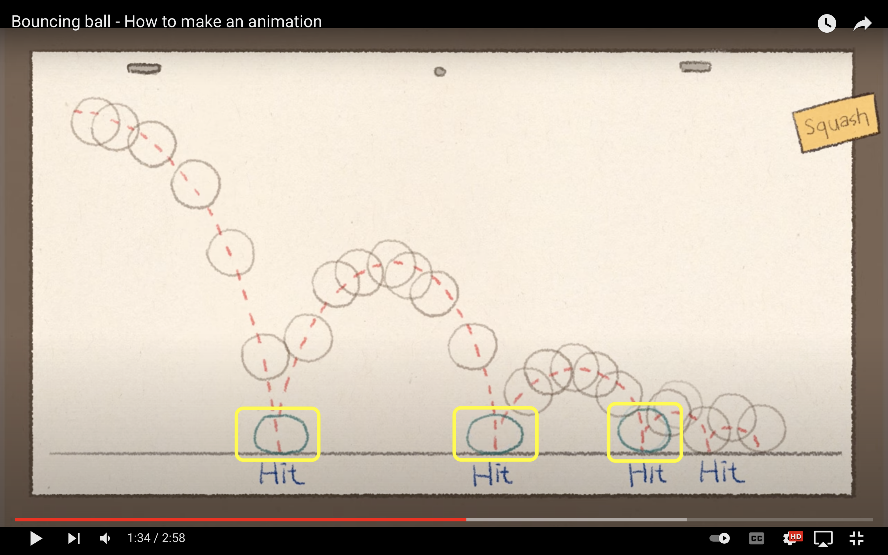
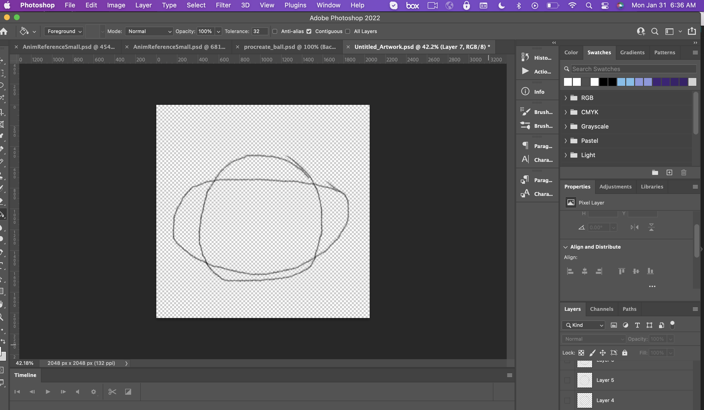
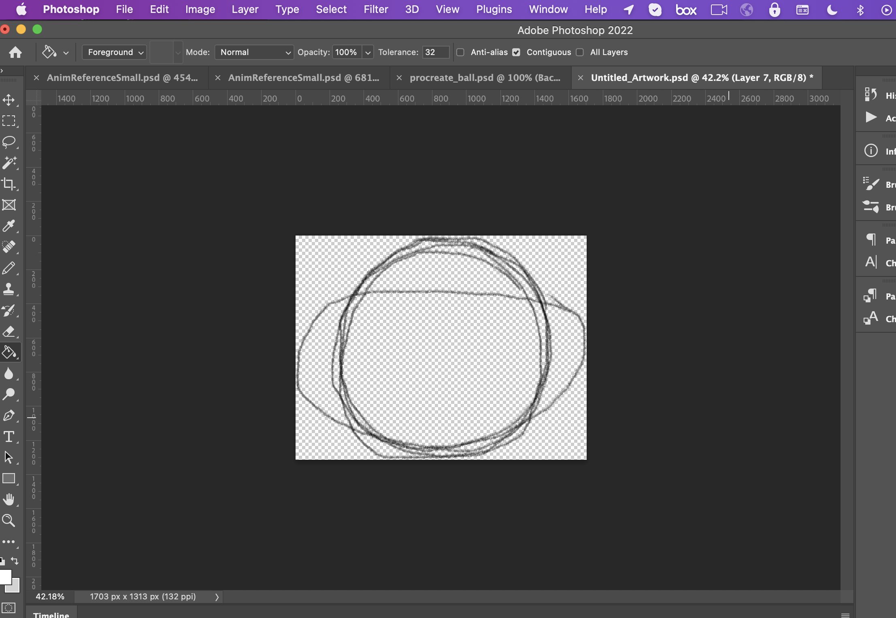
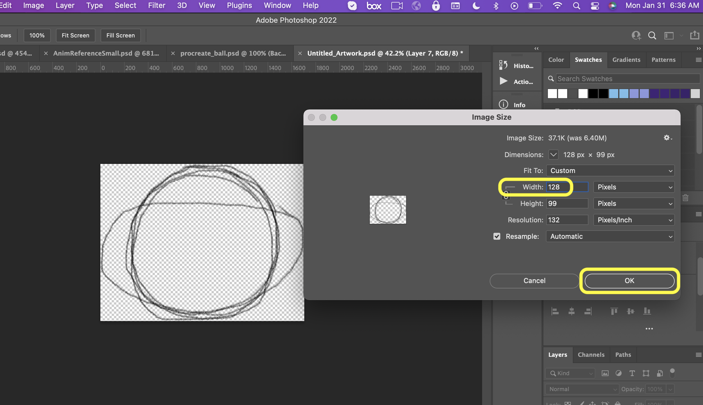
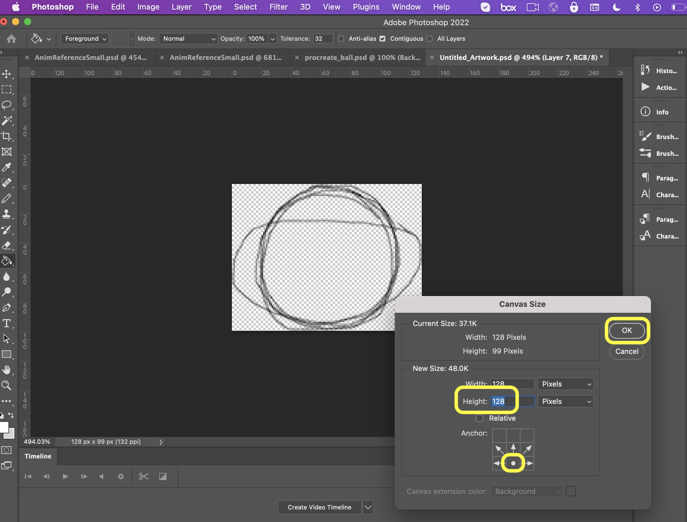
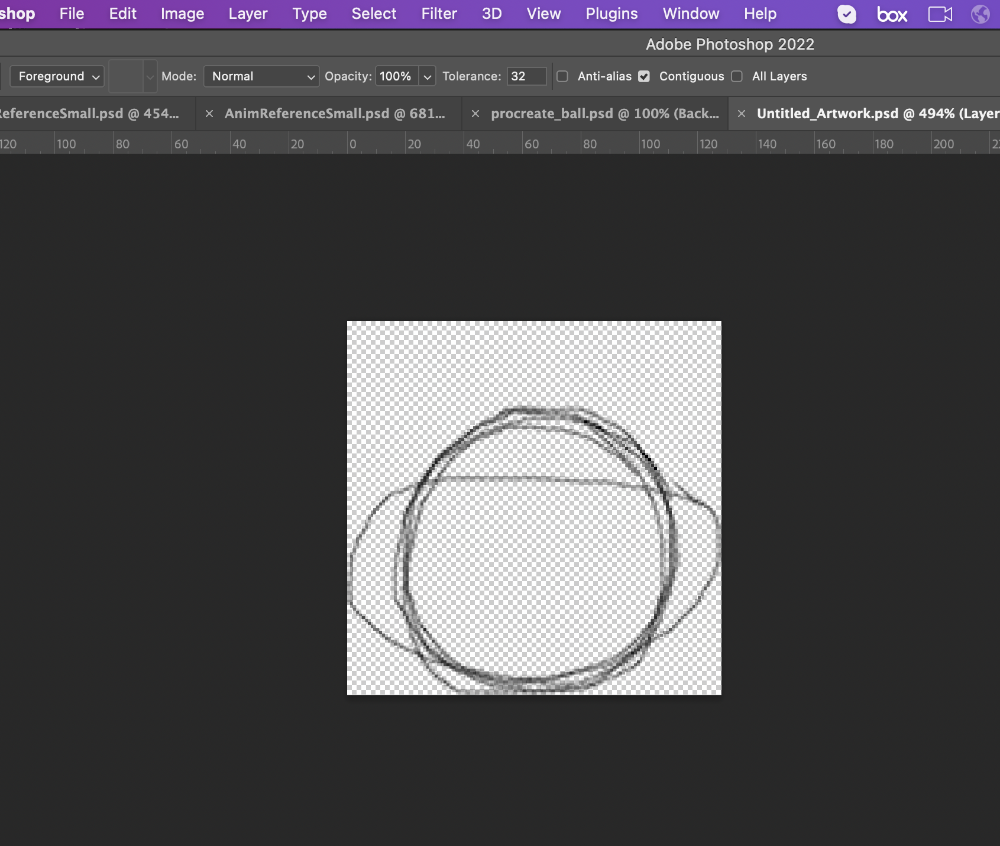
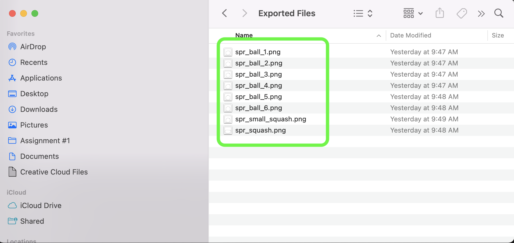
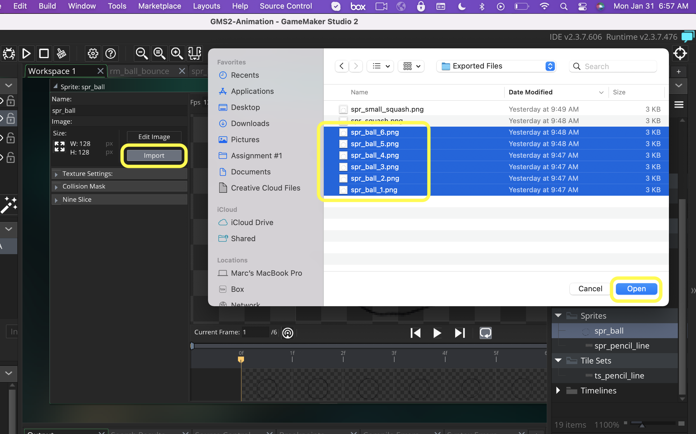
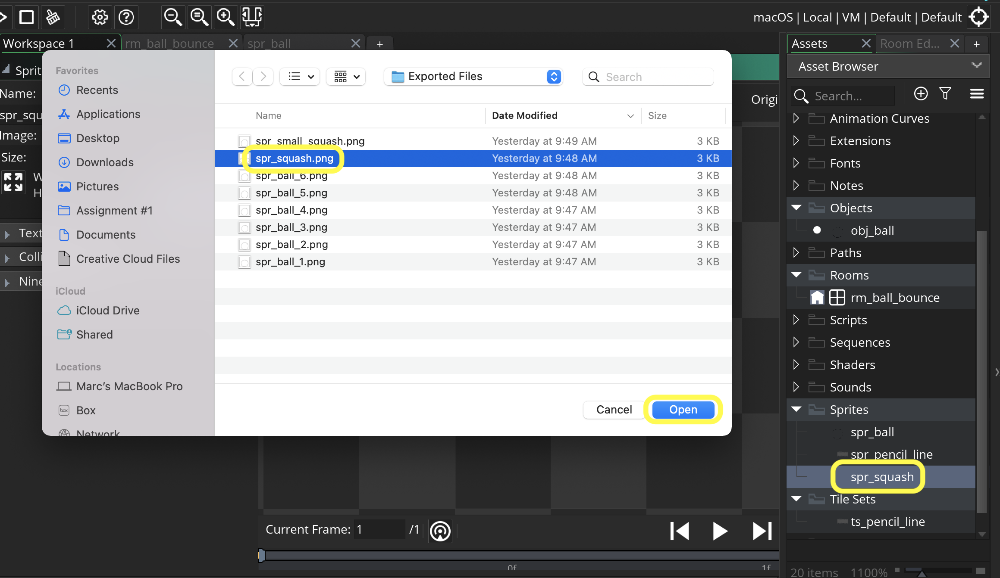
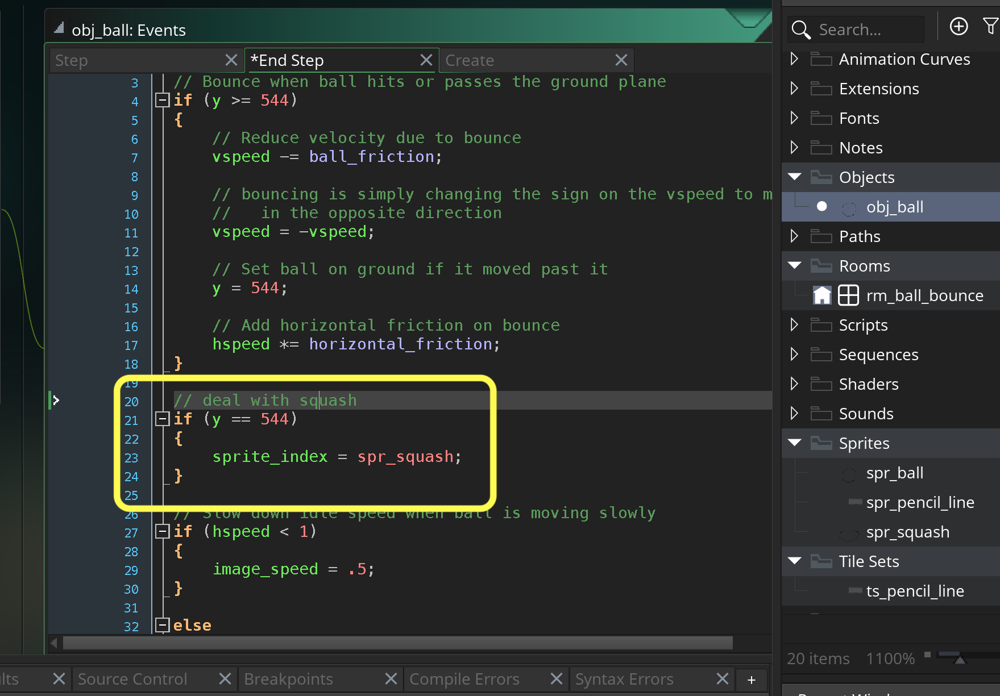

### Squash and Stretch

[previous](../) • [home](../README.md#user-content-gms2-background-tiles--sprites---table-of-contents) • [next](../)

Now the next step in the animation was the squash and the stretch. The ball squooshes when hitting the ground. It gets a bit flatter.  This happens also with a real ball but in 2-D animation this is exaggerated for effect.  Also when the ball bounces up it stretches then returns to its circular form when it slows down reaching its apex.

 

---

##### `Step 1.`\|`BTS`|:small_blue_diamond:

Now the next step in the video was to add a **squash** to the animation on the bounce.  Notice that it is a last two bounces have a smaller squash than the first two.

##### `Step 2.`\|`BTS`|:small_blue_diamond: :small_blue_diamond: 

Now draw on top of the balls with two more squash levels.  One large one and a small one with a bit of a flat bottom.

##### `Step 3.`\|`BTS`|:small_blue_diamond: :small_blue_diamond: :small_blue_diamond:

Turn all layers on. Now the problem when we trim and clip these that the ball we have will get smaller proportionally to the squash.  So we need to re-export the new  squash frames and old ball frames.

##### `Step 4.`\|`BTS`|:small_blue_diamond: :small_blue_diamond: :small_blue_diamond: :small_blue_diamond:

Now turn off the white background and select **Image | Image Size**.  Now it is wider than it is tall so change the **Width** to `128` and press the <kbd>OK</kbd> button.

##### `Step 5.`\|`BTS`| :small_orange_diamond:

Now go to **Image | Canvas Size** and change the **Height** to `128` and make sure the ball stays at the bottom of the frame.

##### `Step 6.`\|`BTS`| :small_orange_diamond: :small_blue_diamond:

Now your ball will be a bit smaller than before but contain the two squash frames as well.  It should look something similar to: 

##### `Step 7.`\|`BTS`| :small_orange_diamond: :small_blue_diamond: :small_blue_diamond:

Re-export the six ball layers as `spr_ball_1.png`, `spr_ball_2.png`,`spr_ball_3.png`,`spr_ball_4.png`,`spr_ball_5.png`, and `spr_ball_6.png`.  Then export the squash frame as `spr_squash`. Finally export the smaller squash frame as `spr_small_squash.png`.

##### `Step 8.`\|`BTS`| :small_orange_diamond: :small_blue_diamond: :small_blue_diamond: :small_blue_diamond:

Open up **spr_ball** and press the <kbd>Import</kbd> button and reimport the six ball frames.

##### `Step 9.`\|`BTS`| :small_orange_diamond: :small_blue_diamond: :small_blue_diamond: :small_blue_diamond: :small_blue_diamond:

*Right click* on **Sprites** and select **New | Sprite** and name it `spr_squash`. Press the <kbd>Import</kbd> button and import **spr_squash.png**.  Name the sprite `spr_squash`.

##### `Step 10.`\|`BTS`| :large_blue_diamond:

##### `Step 11.`\|`BTS`| :large_blue_diamond: :small_blue_diamond: 

##### `Step 12.`\|`BTS`| :large_blue_diamond: :small_blue_diamond: :small_blue_diamond: 

##### `Step 13.`\|`BTS`| :large_blue_diamond: :small_blue_diamond: :small_blue_diamond:  :small_blue_diamond: 

##### `Step 14.`\|`BTS`| :large_blue_diamond: :small_blue_diamond: :small_blue_diamond: :small_blue_diamond:  :small_blue_diamond: 

##### `Step 15.`\|`BTS`| :large_blue_diamond: :small_orange_diamond: 

##### `Step 16.`\|`BTS`| :large_blue_diamond: :small_orange_diamond:   :small_blue_diamond: 

##### `Step 17.`\|`BTS`| :large_blue_diamond: :small_orange_diamond: :small_blue_diamond: :small_blue_diamond:

##### `Step 18.`\|`BTS`| :large_blue_diamond: :small_orange_diamond: :small_blue_diamond: :small_blue_diamond: :small_blue_diamond:

##### `Step 19.`\|`BTS`| :large_blue_diamond: :small_orange_diamond: :small_blue_diamond: :small_blue_diamond: :small_blue_diamond: :small_blue_diamond:

##### `Step 20.`\|`BTS`| :large_blue_diamond: :large_blue_diamond:

##### `Step 21.`\|`BTS`| :large_blue_diamond: :large_blue_diamond: :small_blue_diamond:

___

| [previous](../)| [home](../README.md#user-content-gms2-background-tiles--sprites---table-of-contents) | [next](../)|
|---|---|---|
