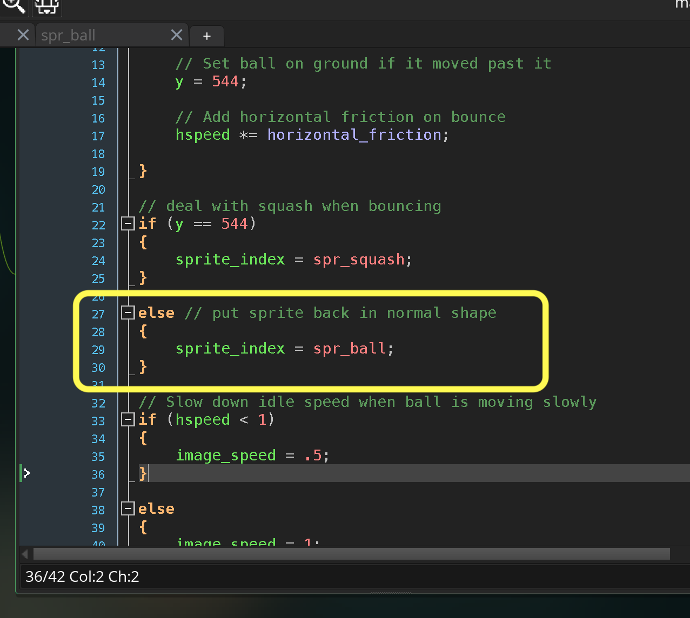
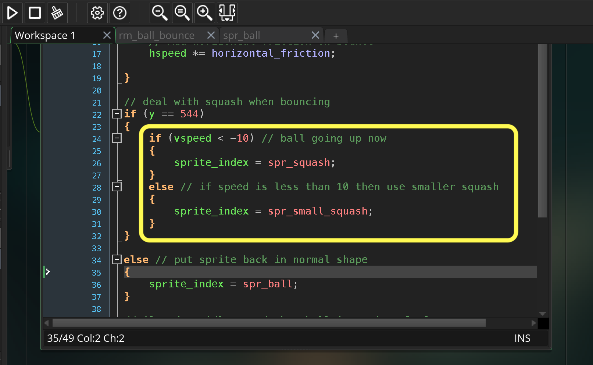
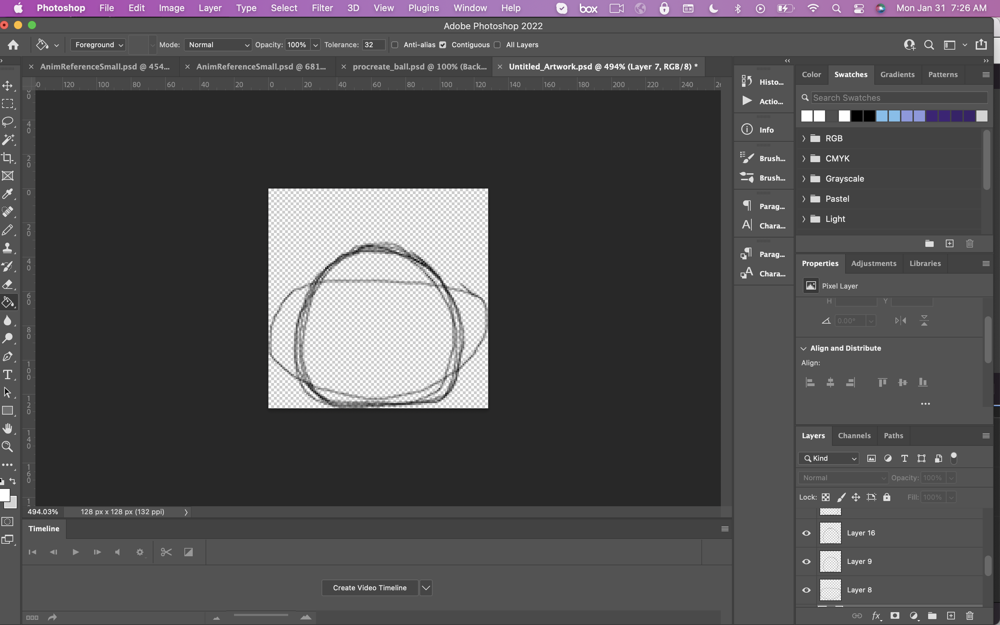
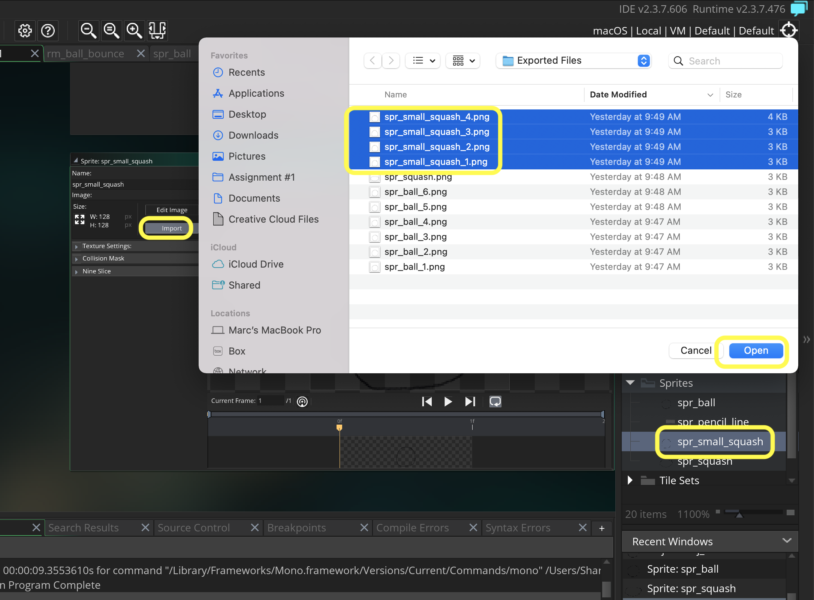
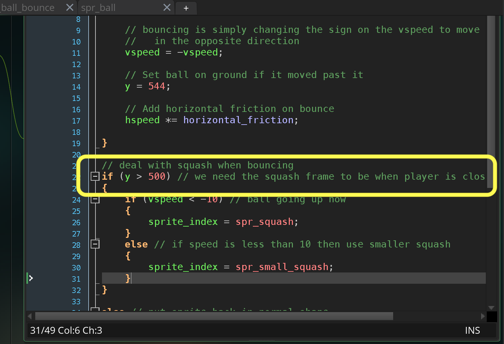

### Squash and Stretch

[previous](../horizontal-movement/README.md#user-content-horizontal-movement) • [home](../README.md#user-content-gms2-background-tiles--sprites---table-of-contents) • [next](../squash-stretch-ii/README.md#user-content-squash-and-stretch-ii)

Now the next step in the animation was the squash and the stretch. The ball squooshes when hitting the ground. It gets a bit flatter.  This happens also with a real ball but in 2-D animation this is exaggerated for effect.  Also when the ball bounces up it stretches then returns to its circular form when it slows down reaching its apex.

 

---

##### `Step 1.`\|`ANIM`|:small_blue_diamond:

Now the next step in the video was to add a **squash** to the animation on the bounce.  Notice that it is a last two bounces have a smaller squash than the first two.

##### `Step 2.`\|`ANIM`|:small_blue_diamond: :small_blue_diamond: 

Now draw on top of the balls with two more squash levels.  One large one and a small one with a bit of a flat bottom.

##### `Step 3.`\|`ANIM`|:small_blue_diamond: :small_blue_diamond: :small_blue_diamond:

Turn all layers on. Now the problem when we trim and clip these that the ball we have will get smaller proportionally to the squash.  So we need to re-export the new  squash frames and old ball frames.

##### `Step 4.`\|`ANIM`|:small_blue_diamond: :small_blue_diamond: :small_blue_diamond: :small_blue_diamond:

Now turn off the white background and select **Image | Image Size**.  Now it is wider than it is tall so change the **Width** to `128` and press the <kbd>OK</kbd> button.

##### `Step 5.`\|`ANIM`| :small_orange_diamond:

Now go to **Image | Canvas Size** and change the **Height** to `128` and make sure the ball stays at the bottom of the frame.

##### `Step 6.`\|`ANIM`| :small_orange_diamond: :small_blue_diamond:

Now your ball will be a bit smaller than before but contain the two squash frames as well.  It should look something similar to: 

##### `Step 7.`\|`ANIM`| :small_orange_diamond: :small_blue_diamond: :small_blue_diamond:

Re-export the six ball layers as `spr_ball_1.png`, `spr_ball_2.png`,`spr_ball_3.png`,`spr_ball_4.png`,`spr_ball_5.png`, and `spr_ball_6.png`.  Then export the squash frame as `spr_squash`. Finally export the smaller squash frame as `spr_small_squash.png`.

##### `Step 8.`\|`ANIM`| :small_orange_diamond: :small_blue_diamond: :small_blue_diamond: :small_blue_diamond:

Open up **spr_ball** and press the <kbd>Import</kbd> button and reimport the six ball frames.

##### `Step 9.`\|`ANIM`| :small_orange_diamond: :small_blue_diamond: :small_blue_diamond: :small_blue_diamond: :small_blue_diamond:

*Right click* on **Sprites** and select **New | Sprite** and name it `spr_squash`. Press the <kbd>Import</kbd> button and import **spr_squash.png**.  Name the sprite `spr_squash`.

##### `Step 10.`\|`ANIM`| :large_blue_diamond:

Open up **obj_ball | End Step** and after the bounce logic, check to see if the ball is on the ground.  If it is then changes the sprite to the one we just imported `spr_squash`.

##### `Step 11.`\|`ANIM`| :large_blue_diamond: :small_blue_diamond: 

Now *press* the <kbd>Play</kbd> button in the top menu bar to launch the game. Woops, now when the ball bounces it is stuck in the squash animation frame.

https://user-images.githubusercontent.com/5504953/151799167-5c5912f3-a31e-45b7-be88-7dad07c35226.mp4

##### `Step 12.`\|`ANIM`| :large_blue_diamond: :small_blue_diamond: :small_blue_diamond: 

Put the sprite back to the regular ball when it is no longer bouncing.

##### `Step 13.`\|`ANIM`| :large_blue_diamond: :small_blue_diamond: :small_blue_diamond:  :small_blue_diamond: 

Now *press* the <kbd>Play</kbd> button in the top menu bar to launch the game. Now the ball goes back but ends with the larger squash.

https://user-images.githubusercontent.com/5504953/151800201-dba0493a-63c7-4ccf-9c0c-37bde7901a6d.mp4

##### `Step 14.`\|`ANIM`| :large_blue_diamond: :small_blue_diamond: :small_blue_diamond: :small_blue_diamond:  :small_blue_diamond: 

Now go back to **obj_ball | End Step** and check to see if the upwards velocity is greater than `10` pixels per frame to use the larger squash else use the smaller one.

##### `Step 15.`\|`ANIM`| :large_blue_diamond: :small_orange_diamond: 

Now *press* the <kbd>Play</kbd> button in the top menu bar to launch the game. Now I find that the ball not moving is a bit disturbing.

https://user-images.githubusercontent.com/5504953/151801538-a15ac6fc-607e-4a0f-a1ec-45cf91dea52d.mp4

##### `Step 16.`\|`ANIM`| :large_blue_diamond: :small_orange_diamond:   :small_blue_diamond: 

So add three layers and draw three small squash frames.  Then you will need to rescale and resize back to `128` to `128` for all frames again!  This time you will add the four exports of `spr_small_squash-1.png`, `spr_small_squash-2.png`, `spr_small_squash-3.png`, `spr_small_squash-4.png`.

##### `Step 17.`\|`ANIM`| :large_blue_diamond: :small_orange_diamond: :small_blue_diamond: :small_blue_diamond:

Open up **spr_small_squash** and press the <kbd>Import</kbd> button and bring in the above 4 frames.  Also, reimport **spr_ball** and **spr_squash** if the scale has changed too much.

##### `Step 18.`\|`ANIM`| :large_blue_diamond: :small_orange_diamond: :small_blue_diamond: :small_blue_diamond: :small_blue_diamond:

Now *press* the <kbd>Play</kbd> button in the top menu bar to launch the game. Play with different speeds, but I settled on `12` fps as the right speed for the squash idle animation we just added this looks a lot better.  

https://user-images.githubusercontent.com/5504953/151803521-f836cf4e-db7a-4c04-b088-dba1324df561.mp4

##### `Step 19.`\|`ANIM`| :large_blue_diamond: :small_orange_diamond: :small_blue_diamond: :small_blue_diamond: :small_blue_diamond: :small_blue_diamond:

We still have an issue.  In the original animation, it was meant to be played back at 8, 12, or 24 frames per second.  The problem is that our framerate is 60 fps (which we want in a game). So one squash frame is too quick a flash.  We need to slow it down.

Go back to **obj_ball | End Step** and change to the squash animation when it is close to the ground, not the single frame it is on the ground for.  This will increase the number of frames it is on the ground and make it read better in the animation.

##### `Step 20.`\|`ANIM`| :large_blue_diamond: :large_blue_diamond:

Now *press* the <kbd>Play</kbd> button in the top menu bar to launch the game. Now that is perfect.  Next up we will look at stretch.

https://user-images.githubusercontent.com/5504953/151804563-f90f6b1e-f430-49c3-8a90-6f366994ba89.mp4

___

| [previous](../horizontal-movement/README.md#user-content-horizontal-movement)| [home](../README.md#user-content-gms2-background-tiles--sprites---table-of-contents) | [next](../squash-stretch-ii/README.md#user-content-squash-and-stretch-ii)|
|---|---|---|
